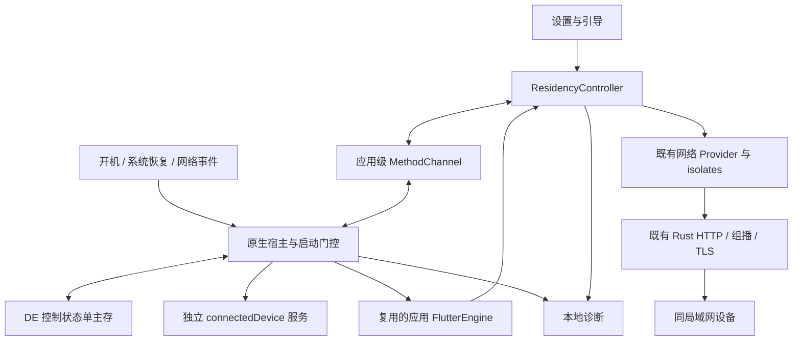
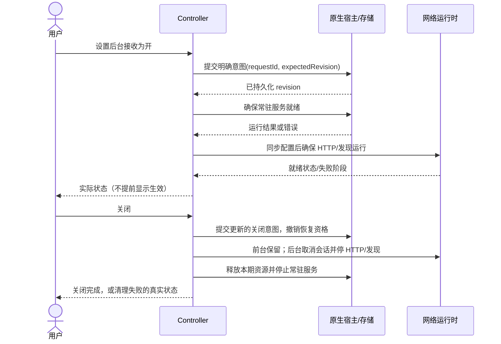

# localsend_x 架构设计：Android 后台接收与开机自启

| 项目 | 内容 |
|---|---|
| 版本 / 日期 | v0.8 / 2026-09-23 |
| 状态 | **待复核**：设计提案；已按独立复核第一轮 R-01…R-11、第二轮 N-01…N-08、所有者确认的取舍与补明条件（§15.5），以及**需求 v1.7 的判据修订**（§10.3）修订，**未被复核者宣布通过**，不据本文宣称已可放行实现；高风险技术验证仍待实现工具执行 |
| 需求基线 | `docs/requirements.md` **v1.7**（原基线 v1.6 的内容提交为 `3187845c`，确认记录 §16.3 提交 `3e2f8a2d`）；**v1.7 的两条修订**（DEC-32 的成功集放宽为含 409、DEC-35 的"不得绕过"限定在发现一侧并给连接一侧留出带闸门的例外）已按所有者授权写入需求文件，记录见其 **§20.18**，本文 v0.8 据此同步 |
| 仓库检查点 | `cc95e37822d859d3bf805788febf80255f9571bf`；`main`，领先本地 `origin/main` 22 个提交；未 fetch；工作区既有 8 个代码文件改动保持不变 |
| 本次范围 | 仅修改 `docs/architecture.md`（v0.8：同步需求 v1.7 的 DEC-32/DEC-35 修订）；不实现业务代码、不改需求或规则、不提交或推送；待同步项见 §15.2 |
| DEC-37④ 交付物 | **未交付**：解锁前能力边界的核实结论（含存储方案与 `directBootAware` 清单改动）转 K-03 回填；本设计只写"如何核实"与"不允许什么"，**不宣称平台允许**（诚实登记，见 §14.4） |
| 接续状态 | 本会话已获文档写入权；既有代码改动及 `.claude/` 保留；`docs/handoff.md` 不存在；不依赖其他工具的聊天记录 |
| 任务 ID | N/A：设计文档任务，未建立实现分支 |
| 复核处理 | 第一轮 R-01…R-11 见 §15；第二轮 N-01…N-08 见 §15.4；**所有者取舍与补明条件（含 N-09）见 §15.5**；未被采纳的部分在相应小节说明依据 |

**文档验收标准**：给出满足当前需求的最小推荐方案、模块和需求映射、时序、界面、数据与接口契约、安全、诊断、交付和回滚；高不确定性有可执行的验证任务、通过标准和失败分支；结尾列出决策、待确认项、风险及进入计划阶段的条件。文档完备不等于功能验收通过。

**阅读标记**：F = 本轮静态核对事实；D = 本文推荐的设计；A = 需求遗留假设；Q = 需要所有者取舍；K = 需要实现工具验证。D 不自动升级为已确认需求。技术资料统一于 2026-09-23 查阅，来源见 §12。

## 1. 范围、约束与技术基线

目标是 Android 在空闲、后台、息屏及重启后继续提供既有 LocalSend 发现与接收能力。两个开关独立、默认开启；开机恢复要求到首次解锁之前；系统用户停止优先于自动恢复。前台关闭后台接收仍保留发现与连接；后台关闭立即停止并按既有取消语义中断传输。需求中的长跑、恢复、负向判据分别执行，不增加在线率、资源或性能指标。

实现允许范围来自 DEC-01 / NFR-006：`app/android/**`、`app/lib/**`、`app/test/**`、`packages/localsend_isolates/**` 及对应 `docs/**`、i18n/生成产物。翻译写入仍跟踪 Q-06。`packages/core`、`server/`、`cli/` 和非 Android 行为不改；SDK、包名、签名及发布需遵守既有授权边界。

**最小方案**：现有 Flutter + Refena + Dart isolates + Rust 网络层，新增一个同进程 Kotlin 常驻服务、一个轻量运行时宿主和一个原生控制状态存储。没有新后端、数据库、消息队列、云监控、多进程守护或周期性轮询框架。已有 WebRTC / 信令能力保留，不把它变成本期依赖。

### 1.1 F：版本与兼容依据

| 组件 | 仓库当前值 / 依据 | 本期选择与检查点 |
|---|---|---|
| Flutter / Dart | `.fvmrc` = 3.41.9；app 与 isolates 的 pubspec 要求 Flutter ^3.41.0、Dart ^3.11.0 | 只用 `fvm flutter` / `fvm dart`；实际捆绑 Dart 版本由实现工具实测，不由约束推断 |
| Refena | `pubspec.lock`：refena / refena_flutter 3.5.0 | 保留现有 provider/action 模式，不引入另一套状态管理 |
| Kotlin / Java / Android 构建 | Kotlin 2.2.0、AGP 8.12.1、Gradle 8.13、Java 编译目标 17 | 官方 AGP 8.12 表列 Gradle 8.13、JDK 17、最高 API 36（S-08）；只说明静态匹配，不证明构建通过 |
| SDK | compileSdk 36、targetSdk 37、minSdk = flutter.minSdkVersion、NDK = flutter.ndkVersion | 全部保持；compile/target 组合及 API 37 符号使用需 K-13 构建实测，失败不擅自升降 SDK |
| Rust / FRB | `rust-toolchain.toml` = 1.97.1；Dart 与 Rust FRB 均 2.12.0，Rust crate 精确约束 =2.12.0 | 不改 FRB 接口；确需生成时工具版本与两端匹配，不能只升级一端 |
| 传输服务 | flutter_foreground_task 9.2.2（lock） | 保留传输链路；常驻服务使用 Android 原生 API，不新增插件 |
| 持久化 / 生成工具 | shared_preferences 2.5.5、Android 实现 2.4.23、dart_mappable 4.8.0、slang 4.19.0（lock） | 普通设置保持现状；新增可靠控制状态走原生单写者；生成代码用锁定工具生成，不手改 |
| 网络核心 | Cargo.lock：tokio 1.53.1、rustls 0.23.43；核心 crate 默认 features 为空 | 不改协议层；若后续做核心验证必须 `--features full`，不能用裸 cargo 失败误判回归 |
| 当前应用版本 | `app/pubspec.yaml` = 1.18.2+64 | 本次不改版本；交付时版本联动规则见 §11 |

`AGENTS.md` 的阶段、目录入口及“全部工具缺失”记录已落后于需求 §16.3/§14.6。D-07/D-08 仍需实现前统一，本次不改规则；历史环境记录不等于本轮工具实测。

### 1.2 F：维护与许可证

- 本轮读取 pub 缓存中锁定版本的 LICENSE/CHANGELOG：Refena、FRB、flutter_foreground_task、dart_mappable、slang 为 MIT；shared_preferences 为 BSD-3-Clause。插件 9.2.2 的变更记录包含前台服务超时修复。发布前按完整依赖树核对许可证与 notices，本表不是全量审计。
- 本机 Flutter SDK 的 LICENSE 为 BSD-3-Clause。Cargo 缓存中的锁定 crate 元数据：tokio 1.53.1 为 MIT、最低 Rust 1.71；rustls 0.23.43 为 Apache-2.0 OR ISC OR MIT、最低 Rust 1.71；FRB 2.12.0 为 MIT、最低 Rust 1.70.0。仓库 Rust 1.97.1 满足这些声明的版本下限，不等于 Android 链接/运行兼容性已通过。以上未覆盖每个传递依赖的许可证。
- pub.dev 插件版本页目前展示比 9.2.2 更新的版本，说明存在后续发布，不代表应升级。shared_preferences 为 Flutter 官方包；FRB 的对应版本页可访问。Refena 3.5.0 版本页本轮读取失败，包主页索引仍显示旧版本，与本地 lock/cache 不一致：**当前线上维护/发布状态未充分核实**，不得据此断言停更或版本不存在。实现工具需验证锁定依赖可重新解析（K-13）。
- 不依赖维护者未来新增多服务或 Direct Boot 支持；保留现有依赖并用小型原生模块隔离新行为。无必要不增加/升级依赖，不擅自移除已有 overrides。
- 根 `LICENSE` 为 Apache-2.0；保留许可证、版权及适用 NOTICE，分发修改版本时保留相应修改说明（S-11）。依赖许可证继续随产物保留；商标/应用名、签名授权与代码许可证是不同事项。现有 FOSS 标记及剥离路径不变，私有分发也不删除第三方声明。

## 2. 关键选择与最小方案

以下沿用 v0.2 的 DD 编号，说明本版变化；实现前必须以确认后的设计为准。

| 决策 | 候选及代价 | 推荐与理由 |
|---|---|---|
| DD-01 常驻服务 | 复用插件：少写 Kotlin，但其 manager 固定指向同一个 ForegroundService；fork 插件：长期维护第三方差异；自建服务：需自行处理通知/生命周期 | **自建同进程 connectedDevice 服务**，保留现有 dataSync 传输服务，满足 DEC-02 独立实例与渠道；不 fork 插件 |
| DD-02 通道 | 全部放 MainActivity：冷启动不存在；新插件：额外工程；拆分现有 handler：小范围调整 | **应用级 handler + Activity 操作适配器**，复用渠道名，宿主引擎注册一次，不要求新插件 |
| DD-03 控制 | 分散回调启停：容易重复监听；单控制器：需串行与代次 | **单 ResidencyController** 收敛用户意图和实际状态；后台入口另由原生门控保护 |
| DD-04 控制状态 | CE 主存 + DE 镜像：双写冲突；全量设置搬到 DE：隐私面大；仅控制状态 DE 单主存：小型原生文件读写 | **DE 单主存 + AtomicFile + 单写者**，取消 v0.2 的控制状态双主同步；普通设置仍在 CE，无新库。结构见 §5 |
| DD-05 运行时 | UI/后台双引擎：需跨容器同步、容易双监听；原生重写网络：越界；一套引擎复用：需拆 UI 初始化，且**UI 专有 override 必须在附着时重新落定、UI 初始化必须可重复**（§3 的两条硬约束） | **一个承载应用网络容器的 FlutterEngine，Activity 可附着/脱离**（K-03/K-08 验证后定案）；不接管插件可能自建的传输任务引擎；`detached` 不得无条件销毁网络 isolate |
| DD-06 恢复 | 高频作业/Alarm：复杂且受启动限制；START_STICKY + 事件驱动 + 有限进程内重试：组件少但受系统限制 | **后者**作为首选，不预先增加 Alarm/Job/WorkManager；失败先实测诊断再评估合法补充路径（K-06/K-11） |
| DD-07 探测 | 新健康端点：修改 core 且不证明真实握手；仅端口：不符合需求；既有协议探测：要处理真实会话竞争 | **既有 prepare-upload/cancel 协议**，验证工件隔离于产品，未闭合的竞争/无人交互条件由 K-12 验证 |
| DD-08 UI | 独立引导流程较重；现有设置页内联状态加首次提示较小 | 推荐后者，仅停止按钮，允许跳过；A-18/Q-13/Q-14/Q-17 保持待确认。无障碍为控件实现质量，不新增业务功能 |
| DD-09 电池引导 | 直接申请忽略优化：多一个权限且仍需用户选择；跳转系统列表：少权限、多一步操作 | **推荐系统设置列表 + 应用设置说明**，取代 v0.2 的直接弹窗提案；不新增 REQUEST_IGNORE_BATTERY_OPTIMIZATIONS。若实测难以完成引导，再提有证据的替代方案 |
| DD-10 可观测 | 远程监控不符需求；只有 console 无法可靠供用户查阅 | **现有 Logger + 本地有界诊断记录 + 既有调试入口**，不加遥测 SDK |
| DD-11 隔离层 | 全面重构不必要；只加宿主控制并复用动作较小 | 优先不改 FRB/core；仅当发现启停或无 UI 事件能力不足时，在已授权 isolates 范围内补最小动作 |
| DD-12 平台隔离 | 所有平台迁移生命周期会扩大风险 | **仅 Android 进入新控制路径**；其他平台保持现状，分别做静态与发布前构建验证 |

**关键隐私提案 Q-ARCH-01**：解锁前运行推荐从 CE 发布一份**最小启动配置快照到 DE**，可能必须包含当前 TLS 私钥/证书及接收 PIN。这不是三个控制布尔的扩展细节：它改变敏感数据可访问的时机，必须在 K-03 给出最小字段与证据后由所有者确认。若不接受，优先核实能否采用兼容现有 FRB 的解锁前密钥访问方案；不能通过新证书、关 TLS/PIN 或仅解锁后运行冒充满足 DEC-37。不能同时满足时回报需求，不在本文自行缩减。

## 3. 模块边界、所有权与核心数据流

拟新增文件名是实现落点建议，不表示文件已存在；同一职责可在邻近现有文件内实现，避免为目录整齐另造框架。

| 模块 | 落点与职责 | 拥有的状态 / 边界 |
|---|---|---|
| M-UI 设置与引导 | `app/lib/pages/tabs/settings_tab.dart` 及相邻 widget | 只呈现快照、发送用户命令；不直接启停 HTTP、不以 widget 存活决定常驻 |
| M-CTRL ResidencyController | 拟 `app/lib/provider/network/residency/residency_controller.dart`；Refena | 唯一应用级网络目标状态与串行迁移；区分意图、过渡、运行失败 |
| M-NATIVE ResidentRuntimeHost / BackgroundReceiveService / BootReceiver | `app/android/app/src/main/kotlin/org/localsend/localsend_app/` | 宿主引擎、常驻服务、通知、自己的锁、网络回调及后台启动门控；同一默认进程 |
| M-STORE ResidentStore | 同上；应用私有 DE 文件 | 控制状态的唯一持久化写者；不会把 UI 内存当作真相；不运行于 `:quick_tile_service` |
| M-BRIDGE | `app/lib/util/native/channel/` 与现有 MainActivity handler | 本地类型校验、命令回执、运行时事件；Activity 操作与无 Activity 操作分开 |
| M-NET 网络适配 | `app/lib/provider/network/server/**`、`packages/localsend_isolates/**` | 复用 ServerService、发现动作、Receive/SendController；会话仍归既有控制器/子 isolate；不放 isolate 逻辑进 task helpers |
| M-CORE 既有协议 | `packages/core`、FRB 绑定 | HTTP v2、组播、TLS、流写入，保持不变；不是 Android 生命周期管理者 |
| M-DIAG 诊断 | 现有 Logger / `app/lib/provider/logging/**` / 调试页，加原生诊断适配 | 有界结构化事件、可查看或导出；不得记录完整原生异常中的敏感参数 |



F：`MainActivity.configureFlutterEngine` 当前注册 `org.localsend.localsend_app/localsend`；`preInit()` 加载 SharedPreferences、设备信息、UI 初始化，再创建携带 securityContext 的 isolate 容器；HTTP 实际启动还在首页初始化流程。两条与之直接相关的既有事实：`main.dart` 的 `detached` 分支**无条件**执行 `IsolateDisposeAction`，而该动作直接 `kill()` 子 isolate（F：`main.dart:72-76`、`packages/localsend_isolates/lib/src/isolate/parent/parent_isolate_provider.dart:99-107`）；`detached` 只表示引擎的视图已脱离，**不等于**持久化运行时应被销毁。⇒ 结论：只新增 Service 不能自动获得后台网络能力；直接复用现有引擎也会在 Activity 脱离时把网络 isolate 一起杀掉，所以 DD-05 必须显式接管这两个既有行为，而不是"复用即可"。

D：宿主为应用网络引擎提供一次初始化/复用/销毁入口。Dart 启动拆为**两段**：

- **必要运行时**（必须在无 Activity 时可用）：日志、`RustLib.init()`、持久化服务、Refena 容器、isolate 容器。后台常驻只依赖这一段。
- **UI/Activity 初始化**（只能在某次 Activity 附着后执行）：权限请求与引导、弹窗、导航、分享订阅，以及 `postInit` 的其余动作。

**两条硬约束（R-03）**：

1. **UI 专有 override 必须在 Activity 附着、且该 provider 首次被读之前重新落定。** 现状在容器构造时就烘入 `dynamicColorsProvider` / `deviceRawInfoProvider` / `appArgumentsProvider` / `tvProvider` / `sleepProvider`（F：`app/lib/config/init.dart:137-148`）。Refena 的 `container.set(override)` 走 `_override(force: true)`，**会替换已初始化 provider 的 notifier 与状态**（F：`refena 3.5.0` 的 `lib/src/container.dart:181-224`、`:294-296`）⇒ "重新落定"在 API 上**可行**（这一点与"首次被读后不可替换"的直觉相反）；但**替换等价于重建该 provider**，凡已读旧值的界面必须能接受这次重建，不得在替换后继续使用捕获的旧值。
2. **UI 初始化必须可重复执行。** 现状 `postInit`（F：`app/lib/config/init.dart:186-314`）由 `HomePage.initState` 触发（`app/lib/pages/home_page.dart:65`），根页面是 `appStart: true`（`app/lib/main.dart:92-97`）；它承载局域网权限请求、`startServerFromSettings()`、发现启动、分享订阅与 `flushPendingShareIntentsAndroid()`、启动参数处理。**若引擎先于 Activity 建立并已 `runApp`，这段流程会在无 Activity 时先跑完一次**：权限调用吞异常返回 false（F：`app/lib/util/native/channel/android_channel.dart:58-65`），分享 flush 失败（F：`:78-84`），而 Activity 之后附着**不会**再触发一次 `initState` ⇒ 该次会话中权限、分享入口与参数路径整段缺失（正是 REQ-011 的回归面）。故 D：**第二次及以后附着必须重新执行 UI 初始化**；无 Activity 时不得先跑一遍会静默降级的 UI 步骤。**但"可重复"不等于"每步都可以无条件重跑"** —— 见下方唯一例外。

**不可重复的副作用必须留在前台路径（F + D）**：`preInit` 以 `supportsDynamicColors: dynamicColors != null` 调用 `PersistenceService.initialize`，后者在键缺失或取值非法时**写入**持久化的颜色模式默认值（F：`app/lib/config/init.dart:77-81`、`app/lib/provider/persistence_provider.dart:185-213`）。取值为 null 时写入 `localsend`；而该值在支持动态取色的设备上**仍然合法**，故下次启动**不会自我修复**。D：依赖插件/Activity 取值才能判定的持久化默认值，**不得**由无 Activity 的后台启动路径写入；后台路径只初始化网络必需的最小持久化。`getDynamicColors()` 本身是否可在无 Activity 引擎下工作属 K-03 的核实项 —— 该插件用 `binding.applicationContext.resources` 取色、**不依赖 Activity**（F：`dynamic_color 1.8.1` 的 `DynamicColorPlugin.kt`），因此风险点是**无 Activity 时插件是否已注册**，而非 API 本身，本文不以它成立为前提。

**"可重复"的唯一例外：缓存清理（F + D；v0.6 收窄范围）**：`postInit` 在 `appStart` 且无初始分享时派发 `ClearCacheAction`（F：`app/lib/config/init.dart:290-294`），而该动作在 Android 上**删除临时目录里的每一个文件**（F：`app/lib/util/native/cache_helper.dart:30-47`；`getCacheDirectory()` 就是 `getTemporaryDirectory()`，F：`app/lib/util/native/directories.dart:35-39`）。同时，下载模式的网页分享会把内存中的字节写成临时文件 `web-download-<uuid>` 并把这些路径交给服务端（F：`send_controller.dart:35-58`）。⇒ 若第二次附着在**网页分享仍在运行**时无条件重跑 `ClearCacheAction`，正在提供的下载会指向已被删除的临时文件：页面仍列 URL，浏览器下载却失败。故 D：`ClearCacheAction` **必须显式排除在"无条件可重复"之外** —— 只在"没有活动的 web-download"时才执行；这是"每步可重复"要求里唯一需要前置条件的步骤，K-08 必须断言它。（v0.5 曾把它描述为"恢复后的下载模式"的问题；**Q-ARCH-03 选定"终止"后，跨前后台的停止不再保留下载模式**，剩余风险只来自"页面打开期间发生的第二次 UI 初始化"，范围因此收窄但**未消失**。）

服务停止但 Activity 仍显示时保留引擎和前台接收；只在既不需要运行时、网络也已清理时才允许销毁。既有传输服务的内部实现不被这一引擎数量约束误伤。

## 4. 状态机与关键时序

### 4.1 输入、优先级和目标状态

输入：平台能力、用户是否已解锁、Activity 可见性、持久化开关、系统停止证据、启动来源、配置版本、网络可用性。`inactive` 只表示暂时失焦，保留前一可见状态；`detached` 不等于销毁常驻运行时（K-08）。"是否在前台"的具体判据见下方权威来源段（以 `onStart`/`onStop` 为准，**不是** Dart 的 `paused`）。

**"是否在前台"的唯一权威来源（D，R-07）**：以**原生宿主注册的 Activity 可见性回调**（`ActivityLifecycleCallbacks` 的对应回调，其 `onStart`/`onStop` 为准）为唯一权威；Dart 侧 `AppLifecycleState` **只用于呈现**，不参与 S 状态迁移判定。理由是判定结果直接决定 S2/S4 与 AC-12 的 B 类结论（零容差）——两个来源一旦不一致就无法给出唯一结论。补充规则：

- 通知栏下拉、多窗口失焦、画中画使 Activity 进入 `inactive` 的情形**不改变判定**；`paused` 也不单独视为后台，只有 `onStop` 才是。**该边界是待实测项，不是已证事实（N-05）**：平台侧只支持"`onStop` 表示不再可见"这一层（S-13），而"下拉通知栏/分屏/画中画**不会**走到 `onStop`"来自二手检索（S-14），本轮**未能直连核对官方页面**。两个方向的偏差都存在且后果不同，必须实测：
  - **伪 `onStop`**（实际仍可见却收到 `onStop`）⇒ 在"开关关 + 前台"下把监听停掉 ⇒ 破坏 DEC-36，并使 AC-12 更严；
  - **漏 `onStop`**（已不可见却没有 `onStop`，例如多窗口下按 Home）⇒ 在"开关关"下继续监听 ⇒ 直接构成 AC-12 的 B 类正向结果。
  ⇒ **K-08 断言**：通知栏展开、画中画、分屏期间不得发生 S2→S4；且多窗口下按 Home 后必须发生 S2→S4。若任一条不成立，**回退规则**为"可见性判定改为原生侧的**综合可见性**（`isInMultiWindowMode` / `isInPictureInPictureMode` 与 `onStop` 共同判定）"，并在本节与 §4.5 同步修订，不静默放宽。
- **迁移时限（可断言，设计初值）**：宿主判为后台后，必须在 **5 秒内**使 HTTP 服务端不再对**新的** prepare-upload 作出应答（已建立的会话按既有语义处理）。5 秒远小于 §14.5 的 5 分钟探测间隔，故不影响判据口径；该值由 K-08 依实测调整。**该时限不替代** §14.5 的 30 分钟 B 类观察窗口 —— 二者是"实现是否及时"与"验收是否出现正向结果"两件事。该时限与 §6.2 的"停止链回执超时"是**两个不同的值**，见上方迁移表和 §6.2（N-03）。
- 进程在回调投递前被冻结/杀死导致超时，如实记录，**不据此改判**为"仍在前台"。

优先级：明确停止/关闭意图 > 后台恢复请求；真实用户主动打开可按 DEC-30 解除系统停止门控；启动失败回滚按 DEC-03；监听失败按 DEC-22。系统 Stop 无回调，退出证据未知不能等同于未停止（K-07）。用户打开必须来自 Activity 的实际用户入口；开机、USER_UNLOCKED、网络回调不能伪造该来源。

| 稳定状态 | HTTP 与发现 | 常驻服务/通知 | 常驻锁/回调 | 说明 |
|---|---|---|---|---|
| S1 前台，后台接收开 | 运行 | 运行 | 持有/注册 | 是否生效取决于就绪状态，不是开关本身 |
| S2 前台，后台接收关 | 运行，保留现状 | 停止 | 释放/注销 | 不停止传输期服务及其资源 |
| S3 后台，后台接收开且入口获准 | 运行 | 运行 | 持有/注册 | 普通后台、合法恢复、获准开机启动 |
| S4 后台，后台接收关 | 停止 | 停止 | 释放/注销 | 会话按既有取消语义中断，清理由 K-09 核实 |
| S5 后台，系统用户停止门控生效 | 不自动启动 | 不自动启动 | 不注册恢复 | 持久化后台开关可仍为开；直到用户打开 |
| S6 用户打开（包括 S5 后） | 按持久化开关转 S1/S2 | 按真实启动结果 | 按目标状态 | 不强行把用户原本关闭的开关改为开 |
| S7 本次开机未获自启许可 | 不启动 | 不启动 | 不注册 | 即使后台开关开，autoStart 关也不能由解锁/网络事件绕过 |

前后台 × 两开关组合必须分别验证：autoStart 只控制开机入口，本次已由用户启动的后台接收不受其关闭影响。BOOT_COMPLETED、LOCKED_BOOT_COMPLETED 与解锁兜底统一门控，只有 `backgroundReceiveEnabled && autoStartEnabled && !userStopped` 且配置/能力可用才尝试启动。窗口内重复广播幂等。

**迁移与承接者（D，R-01）**：上面的稳定态表只给了状态，没有说明**谁**把某个状态拉回另一个状态。下表把它补全；未列入的迁移不发生。

| 迁移 | 触发 | 承接者 | 动作 | 不变量 |
|---|---|---|---|---|
| S1 → S2 | 前台关闭「后台接收」 | M-CTRL | 停常驻服务/通知/锁/恢复注册；**HTTP 与发现保持运行**（DEC-33/DEC-36） | 不中断进行中的传输 |
| S2 → S1 | 前台开启 | M-CTRL | §4.2 的开启流程 | 开关与运行状态一致 |
| S2 → S4 | 前台（开关关）退到后台（Activity `onStop`） | M-CTRL，由原生可见性回调驱动 | **终止网页分享窗口**（Q-ARCH-03，见 §4.5 规则 7），再按"顺序与屏障"段停止 HTTP 与发现、按既有取消语义中断会话、停常驻服务/锁/恢复注册 | 与 §4.4 的网络变化重建互斥；不得把开关改写为开 |
| **S4 → S2** | 后台（开关关）**回到前台**（`onStart`） | **M-CTRL** | 用 `startServerFromSettings()` 恢复（alias/port/https 取自设置）并启动发现；**不恢复 web 模式** —— 该窗口已在 S2→S4 终止，按 Q-ARCH-03 由用户重新进入网页分享页 | 开关仍为关；不得因此改写开关或常驻服务状态；不得"顺手"回到上一个 web 模式 |
| S1 ⇄ S3 | 前台（开关开）与后台之间切换 | 无需动作 | 资源列在两态相同（服务/锁/HTTP/发现都保持） | 只有"是否在前台"这一标记变化；不重启任何组件 |
| （启动/恢复）→ S3 | 开机恢复、网络事件恢复、`am crash` 后重建，且门控通过 | M-NATIVE → M-CTRL | §4.3 / §4.4 / §9.1 的启动流程 | 只有一个常驻服务实例；同一时刻只有一个服务端实例 |
| S3 → S4 | 用户点常驻通知的"停止"（后台可见时） | M-CTRL | §4.2 的关闭流程（与 S2→S4 同一条停止路径） | 开关持久值改为关；不再由后台机制恢复 |
| 任意 → S5 | 识别到系统用户停止（退出历史） | M-NATIVE → M-CTRL | 不自动启动、不注册恢复 | 开关持久值不变 |
| S5 / S7 → S6 → S1 或 S2 | 用户主动打开 | M-CTRL | 按持久化开关恢复；清除已识别停止标记 | 不得静默把用户关过的开关改为开 |
| 开机 → S7 | 本次开机未获自启许可（`autoStart` 关或能力不可用） | M-NATIVE | 不启动、不注册恢复 | 与 S5 分开记录，不互相掩盖 |

**S4 → S2 与 S6 的关系**：开关为关时，"用户重新打开应用"必然先经过 `onStart`，因此该情形**就是** S4→S2，不需要第二条路径；两条规则不冲突，也不会各自启停一次（`ensureNetwork` 必须读取当前实际状态后再决定，见 §6.1）。

**S4 → S2 的具体承接者（R-01 + N-01，F + D）**：现状唯一相关的钩子是 `main.dart:58-66` 的 `resumed` 分支 → `serverProvider.ensureRunning()`，而 `ensureRunning()` 在 `state == null` 时直接 `return`（F：`app/lib/provider/network/server/server_provider.dart:385-389`），`stopServer()` 又把 `state` 置为 null（F：`:230-236`）⇒ **它对已停止的服务端是 no-op，不能承接本迁移**；按现状接线会得到"回到前台仍不可被连接/发现"。故 D：本迁移由 M-CTRL 在"回到前台 且 开关为关 且 服务端未运行"时显式恢复；`ensureRunning()` 只保留其原用途（探测仍存活的服务端是否失去监听），不作为恢复手段。

**恢复不带 web 模式 —— 由 Q-ARCH-03 决定"终止"（v0.6，所有者已确认）**：N-01 指出的缺陷是"网页分享被**静默**废掉而页面仍显示运行中"。本轮复核者给出两个方向，**所有者已选定"终止"**：常驻状态机一旦要求停止监听，网页分享窗口即**结束**，并由页面**同步呈现"已停止"**（§4.5 规则 6/7）；S4→S2 因此走 `startServerFromSettings()`（不带 `web`）就是**正确行为**，不是缺陷。这条决定同时解释了为什么**不再需要**"记住网络意图"：恢复不需要它，而终止路径也不需要它（终止是"不再恢复"，不是"恢复成另一个模式"）。F 依据仍保留在下方，因为它正是"必须让页面知道"的理由：

- `startServerFromSettings()` 不传 `web`（F：`server_provider.dart:102-109`），`startServer` 对 `web == null` 取 `WebMode.disabled()`（F：`:155-165`），核心对 `WebShare::Disabled` 在 `/` 返回 403 页（F：`packages/core/src/http/server/web.rs:105-107`、`:298`）。⇒ **任何"服务端被重启但没有通知页面"的路径都会造成页面说谎**（继续列 URL 而浏览器拿到 403）。因此本决定的落地要求不是"恢复模式"，而是**页面必须能观察到模式已失效**（§4.5 规则 6）。
- `_restartDeadServer`（F：`server_provider.dart:407-431`）是既有代码里"保留 web"的例子，本设计**不采用**它的形态 —— 那是"监听意外死亡后就地自愈"，与"常驻状态机主动停止"是两件事；前者不得被误用来绕过本决定。

**触发条件收紧（沿用 A-19：最后明确用户意图优先）**：S4→S2 只在停止**由本设计的状态机（S2→S4）造成**时执行。若用户在前台设置页显式停止过服务端（现状 `onTapStopServer`，F：`app/lib/pages/tabs/settings_tab_controller.dart:157-165`），回到前台**不得**自动拉起 —— 那是"沿用现状"的一部分，不因本设计而改变。区分这两者需要一个显式标记，字段见 §5.1 的 `serverStopCause`（N-06）。

**S2→S4 的顺序与屏障（N-03，D）**：停止是**跨通道两步**，顺序与超时必须写死，否则"5 秒内不再应答"无法保证：

1. M-CTRL 先向网络层下达停止（取消会话 → 停 HTTP → 停发现），并**等待完成回执**；
2. 只有拿到该回执后，才请原生宿主停止**常驻服务**/通知/锁/恢复注册。

即**网络停止回执是停止常驻服务的前置屏障**（正常路径）。若在回执之前就停掉常驻服务，进程可能被降级/冻结，使第 1 步永远完不成，5 秒时限变成空话。

**超时后的有界升级（N-09，所有者已确认）**：超时**不以"保持可应答"收场**。优先级由所有者定为 **"宁可冻结也不保持可应答"** —— 因为 AC-12 是零容差 B 类：**"仍在应答"是硬失败，"进程被冻结"不是**。故超时后按下列**有界**阶梯升级，每级都记事件、不无限重试：

| 级 | 动作 | 代价 / 备注 |
|---|---|---|
| ① | 按"确保目标状态"重试一次网络停止（幂等，不用 toggle） | 无额外代价；§6.2 末条已要求 |
| ② | 仍无法确认已停止 ⇒ 由 M-NATIVE **强制停常驻服务**（`stopService`/`stopSelf`），接受进程可能被系统冻结在停止中途 | 只停**本期新增的常驻服务**，**不得**触碰传输期服务（其生命周期归既有传输路径） |
| ③ | 若仍无法确认监听已终止 ⇒ **终止监听本身**：杀网络子 isolate（与既有 `IsolateDisposeAction` 同一手段，F：`parent_isolate_provider.dart:99-107`） | 代价最高：该会话内网络运行时需**重建**（`IsolateSetupAction` 重跑）才能再次启动；因此标为 degraded，并在下次恢复时显式重建，不假装状态完好。**这一级才是"不可应答"的保证**（见下方限定） |

**升级后不得宣称"已停止"**：清理未被确认时，对外呈现"停止中/异常"（§7.1），记录 `cleanup_failed` 类事件与已执行的级数；**5 秒迁移时限仍是断言**（宿主判为后台后不再应答新的 prepare-upload）—— 阶梯是为了让这条断言在超时路径上也能成立，而不是替代它。

**关键限定：② 不保证"不可应答"，③ 才是保证（N-09 的落地要点）**：停掉常驻服务后，进程**可能**被系统冻结，但冻结**不是契约**（前台服务停止后进程可以继续存活一段时间）。因此"宁可冻结"只解释了**为什么可以接受**停服务这个副作用，**不能当作"已经不可应答"的依据**。真正让"不可应答"成立的是：**网络监听被终止**（③ 杀网络子 isolate，与 `IsolateHttpServerStopAction` 的不同在于后者只停服务端未必能终止 socket；两者都要在 K-08 里以实际探测确认）。⇒ 实现不得在 ② 之后**假设**已经不可应答就停在半路：只要还无法确认监听已终止，就必须走到 ③；只有探测确认不再应答（或 ③ 已执行）才算达成时限断言。

两个时限的区分：

| 名称 | 值（设计初值） | 含义 | 断言位置 |
|---|---|---|---|
| **迁移时限** | **5 秒** | 宿主判为后台后，服务端不再对**新的** prepare-upload 作出应答 | TC-08 / K-08 |
| **停止链回执超时** | **2 秒** | 第 1 步命令的本地回执等待上限（小于迁移时限，留出第 2 步余量） | §6.2 / K-08 |

实际状态单独表示 `stopped / starting / ready / degraded / stopping / blocked`；snapshot 同时包含 `serviceRunning/httpReady/discoveryReady/networkAvailable/notificationVisible/error`。ready 不代表外部网络连续可达的证明；验收仍需要对端协议探测。

### 4.2 用户开启、失败与并发关闭



按 A-19 推荐最后明确用户意图优先：所有入口进入一个队列；原生提交序号单调增加，异步结果携带 revision，过期开启结果不能覆盖关闭。重复关闭不重复取消其他会话。服务启动被拒时只对仍匹配的开启 revision 回滚为关，不能回滚更晚用户操作。收到关闭立即取消待启动/重试，后台不等待文件传完；若持久化失败，仍停止当前运行、报告“未保存，重启状态不保证”，不能宣称跨重启关闭成功。

### 4.3 开机、解锁与打开应用

1. 接收开机广播，读取 DE 控制记录和系统停止历史；记录入口来源。缺失/损坏/停止证据未知走 §5 的未就绪分支，不先拉起网络再补查。
2. 门控允许才启动独立 connectedDevice 服务，原生先创建实际通知并进入前台，随后初始化应用引擎；不等待 Flutter 初始化才 startForeground。
3. 解锁前使用已验证的最小配置快照，复用既有身份/TLS/PIN，完成同步状态后才启动发现与 HTTP。未取得配置不能换成默认空 PIN 或临时身份。
4. `USER_UNLOCKED` 由运行组件动态注册接收，结合 `UserManager.isUserUnlocked()`；只对齐配置/后续能力并更新运行状态，不清停止标记、不弹权限或引导。BOOT_COMPLETED 兜底同样遵守门控。
5. 用户主动打开时附着现有引擎；若引擎不存在则创建。此路径可解除系统停止门控，按保存的开关恢复。初始化 UI 后才请求缺失权限、显示引导。

K-03 必须覆盖无 Activity 插件注册、RootIsolateToken、FRB、安全上下文、保存目标和用户确认路径；仅看到一条服务通知不是通过。解锁前需要用户接收确认时，不能偷偷改为自动接受；该模式的正常握手/取消结果由 K-12 验证。

### 4.4 网络变化和停止资源

网络事件触发 IP/接口刷新、受控重新绑定发现与监听；不用后台 UI resumed 作为唯一触发。先判目标状态，前台关闭后台开关时仍维护前台网络；后台关闭时禁止重建。网络切换不重启常驻服务，不主动清空传输状态以图省事；既有连接确已失效才走既有错误处理。

锁采用独立实例/标签，获取/释放幂等；Wi-Fi 锁与组播锁是不同对象。按系统版本选可用 API（K-06），不能把持锁当作必然在线。关闭只释放本期锁；后台 S4 所需的传输取消及传输服务释放由既有会话路径完成。HTTP stop 不等于组播停止，具体动作缺口由 K-09 补证。

### 4.5 服务端重启路径与常驻就绪（R-02）

**F（现状行为，2026-09-23 静态核对）**：应用网络服务端是**进程级单实例**，多处以 "stop + start" 方式重启它，而不是新建实例：

- 网页分享页进入：`web_share_page.dart:72-92` 调 `restartServerWithWebDownload(...)`（有文件）或 `restartServer(...)`（接收模式）；离开：`:106-109` 调 `restartServerFromSettings()`。三者最终都走 `server_provider.dart:238-251` 的 stop + start；网页分享默认以**明文 http** 打开（`_encrypted` 初值 `false`）。
- 设置变更后的重启：接收 PIN `settings_tab.dart:202-205`、校验设置 `:269-272`、端口/别名/协议 `settings_tab_controller.dart:135-156`、web PIN `server_provider.dart:299-321`。
- 监听永久失败后的自愈重启：`server_provider.dart:374-380`、`:407-421`。
- 既有代码注释明确"会话不跨服务端重启存活"（F：`server_provider.dart:313` 的注释，`setWebPin` 随即清空 `sessions`）。

**与本期设计的冲突点**：① DEC-33 的服务端生命周期状态机里没有"服务端被上述路径重启"这一状态；② `residentPublishNetworkState` 用**引擎代次**作废陈旧 ready，而上述重启**不改变引擎代次** ⇒ 重启前的 `httpReady` 会被当成当前事实；③ "前台关闭开关仍保留监听"的判定会被网页分享的 stop/start 打破（引用历史状态就会判错）；④ **常驻状态机的停止/恢复会毁掉网页分享模式**（N-01，见规则 7）。REQ-011 边界把这一条点名为"设计阶段须核实"，本节即该交付。

**D（承接规则）**：

1. **不改变既有行为**：网页分享继续复用同一服务端、同一端口，不新开端口、不新建第二实例、不改协议，`packages/core` 不改。端口沿用 `settings.port`。接收模式下网页分享继续使用 `settings.receivePin`（F：`web_share_page.dart:69-70`）。**该窗口的加密状态分两支（N-02 更正表述）**：
   - **默认分支：完全明文 HTTP，没有 TLS，也没有客户端证书校验。** 页面 `_encrypted` 初值为 `false`（F：`web_share_page.dart:43`）⇒ `https: false` ⇒ `server_isolate.dart:407-412` 给 FRB 的 `tls` 传 **`null`**，而 FRB 签名为 `tls: Option<TlsConfig>`（F：`packages/localsend_isolates/rust/src/api/server.rs:202-214`）⇒ 收到 `None`，即**该窗口不启用 TLS、不校验证书**。v0.4 把它写成"放宽客户端证书要求"**偏轻**，已按实际改写。
   - **可选的加密分支**：用户在页面上打开加密开关后重新初始化（F：`web_share_page.dart:339-346` 的 `_init(encrypted: value == true)`），此时才是 AGENTS.md 所述的"TLS + 客户端证书可选（为让浏览器能连）"。
   - **对 §8.1 的影响**：默认分支下**没有客户端证书**，因此 `certFingerprint` 在该窗口不可得，app 只能走既有的"明文模式才回退 payload"规则；该窗口内的常驻就绪**不得**被当作"常驻安全模式可用"的证据（§8.1）。
2. **引入"服务端代次"，与"引擎代次"分离**：`residentPublishNetworkState` 的载荷增加 `serverGeneration`，由 M-NET 持有，每次**成功** start/restart 递增；原生只接受当前 `(engineGeneration, serverGeneration)` 的 ready，**任一代次变化都作废旧 ready**，直到收到新发布。`engineGeneration` 的语义（引擎创建/销毁）不变。由 M-NET 上报而非原生推导是**复核者已确认**的结论：`_restartAfterListenerFailure → _restartDeadServer` 这类纯内部自愈，原生完全看不到，从命令序列推导必然漏计（§15.3 第 2 条）。
3. **判定以当前事实为准，不以历史为准**：S2/S4 的"HTTP 是否在运行"必须读**当前代次的实际运行状态**，不得引用"进入网页分享前它在跑"。网页分享的 stop/start **既不能**作为"前台关闭开关仍在监听"的证据，**也不能**作为"已停止"的证据。
4. **常驻意图优先于旁路功能**：若常驻判定要求停止监听（S4）而网页分享页正处于活动状态，**以停止为准**：网页分享页必须呈现"已停止/不可用"，不得继续显示运行中；离开该页时，在"开关关 且 不在前台"下**不得**自动拉起服务端。反向（S1/S2 的前台窗口）保持既有行为。
5. **对 AC-12 的影响**：按第 4 条，即使网页分享页处于活动状态，"开关关 + 不在前台"也必须停止监听 ⇒ AC-12 的 B 类负向判据**不需要**为网页分享开例外，但 TC-08 必须把"网页分享页活动时退到后台"作为一条**断言**，而不是把它排除在观察之外。
6. **页面必须能感知代次与模式（N-01 附带）**：网页分享页当前只 `watch(serverProvider)` 并用自身的 `_stateEnum` 表示运行（F：`web_share_page.dart:172-177`、`:195`）。它必须改为**按当前代次与当前 web 模式判定显示**，否则会出现"服务端已不是它开的那个模式，页面仍显示运行中并给出 URL"。已知的具体错法：接收模式下 `web` 丢失后 `serverState != null`、`_sendMode == false` ⇒ 守卫通过，页面继续列出 URL 且 `pin` 变为 `null`（URL 少掉 `?pin=`）；下载模式下 `webDownloadState == null` ⇒ 页面停在无限转圈。两者都不许留到实现阶段自行发挥。**判定规则**：页面只在"当前代次仍是它启动的那一个**且**模式与它启动的一致"时显示运行并列出 URL；否则显示"已停止"（见规则 7）。
7. **常驻停止 ⇒ 网页分享窗口终止（Q-ARCH-03，所有者已确认，v0.6；取代 v0.5 的"模式延续"）**：这是本轮复核给出的两个方向之一，**所有者选定"终止"**：只要常驻状态机要求停止监听（S2→S4，以及 S3→S4 的同一条停止路径），**网页分享窗口即结束**：
   - **不恢复**：S4→S2 用 `startServerFromSettings()` 恢复普通接收，**不回到** web 模式，也不"回到上一次的模式"；用户要再次分享需**重新进入**网页分享页（重新走 `_init`）。这是**预期行为**，不是缺陷。
   - **必须显式呈现**：页面按规则 6 检测到模式已失效后，呈现"已停止"，并给出原因（"应用退到后台且后台接收已关闭"一类），**不得**继续显示运行中或继续列出 URL；不自动重启网页分享（不产生无用户触发的模式切换）。
   - **中断是既有语义**：浏览器正在进行的下载/上传被中断，按既有取消语义处理；接收 PIN 回到 `settings.receivePin`（不再是 web 的 PIN）；下载模式引用的临时文件不再被引用（因此此后可被缓存清理回收，见 §3 的"唯一例外"）。
   - **不是"离开页面"**：用户主动返回仍走既有的 `_revertServerState()`（F：`web_share_page.dart:106-109`），两条路径互不替代。
   - **开关为开（S1⇄S3）时不受影响**：不停止监听，网页分享继续有效 —— 本终止只发生在"开关关 且 不在前台"这一条路径上。
   - **新增用户可见文案**：该"已停止 + 原因"是本设计新增的 UI 状态，文案走 slang，受 **Q-06**（翻译写入授权）与 NFR-009 约束；Q-06 未确认前可先实现结构与语义，但**不得**把文案从完成标准中删去。
   - **为什么这条闭合了 N-01**：N-01 的缺陷是"**静默**废掉且页面说谎"。终止让"模式不再存在"成为**被明确呈现的预期结果**，页面不再显示它无法兑现的 URL ⇒ 不再有静默回归。反之，**只把模式恢复而不让页面知道代次**仍是缺陷（v0.5 的做法），因此规则 6 与规则 7 **必须同时实现**，缺一不可。
   - **断言**：TC-08（后台停止）与 TC-11（回来后页面呈现停止且不复现 URL）、K-09（见 §10.4）。
8. **验证归属**：上述交接由 K-09 覆盖（其"逐项停止"已含 web send）与 K-08 的代次断言共同验证；本轮**未执行**任何动态验证，故本节结论为设计规则而非实测结论。REQ-011 的"端口/证书行为已核实"只能由 K-09 的证据回填后才成立。N-01 的最小复现命令见 §10.4 的 K-09 行。

## 5. 数据模型、持久化和恢复

CE = 用户首次解锁后可用的凭据加密存储；DE = 系统直接启动阶段可用的设备加密存储（S-02）。两者均是应用私有目录，DE 不具备 CE 的首次解锁访问门槛。

### 5.1 单写者与数据结构（D）

| 数据 | 字段 / 约束 | 唯一所有者与生命周期 |
|---|---|---|
| ResidentControl v1 | `schema=1`、`revision>=0`、两个 bool 开关、`userStopped`、已处理退出记录标识、最后命令 ID、恢复预算元数据、**`createdBy`/`initializedAt`（仅诊断，R-05）** | 原生 M-STORE；DE 的 `resident/control.json`，由 AtomicFile 整体提交；生命周期跨进程/重启；不放在 Flutter prefs 再建第二主存。`createdBy` 记录写入来源（首次前台初始化 / 迁移 / 修复），供 K-07/K-10 区分"我们写的默认值"与"读到的他方记录" |
| RuntimeSnapshot | 控制 revision、配置 revision、**引擎代次 + 服务端代次**、phase、各就绪位、来源、错误、事件序号、**`serverStopCause ∈ {stateMachine, userExplicit, none}`（N-06）** | M-CTRL 与原生服务分别报告自己拥有的事实；聚合后只读发布，不把 ready 持久化供下次启动直接相信。`serverStopCause` 是**内存态、不持久化**，用于区分"本状态机停的"（S4→S2 应自动恢复）与"用户显式停的"（不自动恢复，§4.1）；没有它，实现者只能自行临时加字段 |
| BootConfig v1（敏感提案） | schema、configRevision、有效标记、最小设备/网络参数、保持同一身份所需安全上下文、接收授权策略及必要保存目标引用 | CE 设置仍是来源；DE `resident/boot_config.json` 是单向派生快照，必须经 Q-ARCH-01 与 K-03 核准字段，不复制全部 prefs。**写入路径（R-06）**：只能经 §6.1 的 `residentPublishBootConfig` / `residentInvalidateBootConfig`；**M-CTRL 是唯一发起者，M-STORE 是唯一落盘者**，不存在第二条 Dart→native 的旁路 |
| GuideState | 每项 `seen/skipped/userAsserted` 与可选记录时间 | CE 现有 persistence；系统检测结果每次刷新，用户自述不覆盖检测值；时间戳仅用于展示 |
| RecoveryState | 当前故障窗口、尝试次数、相关控制 revision、启动来源 | 原生恢复预算记录；单调时钟用于同次开机计时，跨重启重新检查来源与预算，不用墙钟控制保活 |
| 既有业务数据 | 文件、接收历史、设备身份、PIN、web-send 状态 | 所有权保持既有模块；本期不迁移历史、不持久化正在传输的会话来自动续传 |

**AtomicFile 不是锁**（S-06）：所有读写在同一进程的串行执行器完成，磁盘操作不阻塞主线程；startWrite / finishWrite，失败 failWrite；提交后校验可读结构才确认成功。无需数据库事务或跨进程锁，因为新组件都在默认进程，快捷磁贴不能直接写此文件。

`revision` 用于并发和幂等，不是时间戳。命令包含 expectedRevision；冲突返回最新快照并让控制器重新计算，不重放过时的开启。关键状态不能依赖 SharedPreferences Dart 缓存刷新：官方明确该插件不保证返回时已落盘（S-07）。普通设置不因此全盘迁移。

### 5.2 控制记录迁移与崩溃恢复

- 首次安装/升级/清除数据后，**用户首次正常启动且证实新键确实不存在**时按 DEC-23 初始化两开关为 true，并显示首次/升级说明。v0.3 尚无已发布旧控制格式，不能凭草稿虚构已有键；若实现时存在旧版本，先核实再做一次性迁移，保留用户关闭值。
- **"记录不存在"的判据定死（R-05）**：DE 控制文件不存在时，**一律走 §4.3 第 1 条的未就绪分支**（不自动启动、启动路径不写任何默认值）；DEC-23 的"缺失键按开启"**只在"用户正常前台启动 + CE 可读 + 确认该键确实不存在"这一条路径上生效**，由前台路径写入初始记录。三种输入因此在设计上走同一条路径：从未初始化 → 未就绪；被外部删除 → 未就绪；损坏/schema 未知 → 未就绪 + 保留诊断（下条）。**"启动路径永不写默认值"是"三条输入走同一路径、且规则不反向"的保证**（若启动路径也会写默认值，"从未初始化"就会被当成"已初始化且为开"，同一条规则随即对同一输入给出相反处理）；**区分来源与事后诊断由 `createdBy`/`initializedAt` 承担**（§5.1），它们**不参与**是否启动的判定，只供 K-07/K-10 的证据区分"我们写的默认值"与"读到的他方记录"。v0.3 的 §4.3 与 §5.2 曾各自读作"未就绪"与"按默认开"，本条消除该歧义，**未改动 DEC-23 本身**（它约束键值语义，不规定启动路径的写入权限）。
- **上述判据的可见后果（须如实登记，归属 A-16）**：**覆盖升级后用户不打开应用即重启，本次不自动恢复**，直到用户打开过一次应用、初始记录被写入。本设计的默认取向与 **A-16 的现有方向一致**（覆盖安装后暂不自动恢复，需求 §15 标"待确认"）。若所有者确认相反方向，则初始化的时机必须前移（例如新增升级后路径），§4.1/§5.2 随之修订 —— **本设计不自行放宽，也不把该分支实现为"看起来成功"**。
- 已有 v1 文件读取失败、schema 未知或校验不合法时，不按“新装默认开”覆盖。先阻止自动恢复、保留诊断信息，用户打开后修复；这属于未达成/待恢复状态，不作为 AC-10 成功。是否能可靠恢复由 K-10 验证。
- 关闭先撤销内存恢复资格，再提交关闭记录，立即进入对应清理路径；只有落盘与清理分别确认后才分别报告“已保存/已停止”。进程恰在写入间退出，重启读取完整旧或新记录，不接受半份 JSON；不存在对突然断电的绝对承诺。
- 系统 Stop 不发送回调（S-01），`userStopped` 只是**已经观测到的证据**。所有后台入口启动前读取退出历史，识别新增用户停止并持久化；历史查询不可用/记录含糊的分支不能当作 false。跨重启可读性、误判正常退出与崩溃的风险由 K-07 验证；若平台无法区分，该需求组合需回报，不加守护进程猜测。
- 用户主动打开才清除已识别停止标记并更新已处理记录游标，防止同一历史 Stop 在后续恢复时再次阻止运行；不能在解锁广播中清除。

### 5.3 解锁前最小配置：事实与候选边界

F：`PersistenceService` 在 `ls_security_context` 中保存 `StoredSecurityContext`；该结构包含 privateKey/publicKey/certificate/certificateHash。`init.dart` 把它传入 SyncState；ServerService 另读取 alias、port、https、receivePin、校验设置与 web 文案。因此控制文件可读不代表网络配置可读。

D：优先审计并发布最小 BootConfig，字段分组如下：

| 分组 | 是否可能需要 DE | 处理 |
|---|---|---|
| 设备别名、协议、端口、组播与接口过滤、设备协议描述 | 需要，保持与解锁后身份/公告一致 | 有效范围沿用既有设置，不自行引入另一默认配置 |
| TLS 安全上下文、接收 PIN/授权规则 | 很可能需要；敏感 | Q-ARCH-01 **已"有条件确认"**（v0.7）：只允许**最小必要快照**；**PIN 不得裸存**，优先 Keystore/硬件绑定；解锁后须迁移/轮换/清除；须有威胁模型与审计（**§8.4**）。仅作为经核实的最小快照；不记录在日志、测试附件或仓库中 |
| 保存目标、SAF 授权、缓存/相册路径 | 取决于握手和实际接收路径 | 快照不能让解锁前不可用的目录自动变可用；逐种策略实测，不重定向用户文件到 DE 充当成功 |
| 主题、窗口、历史、购买、UI 导航 | 不需要 | 不迁移，UI 附着并解锁后初始化 |

发布协议（**含写入路径与载荷约束，R-06**）：涉及身份/PIN/端口等设置变更前，先经 `residentInvalidateBootConfig(configRevision)` 把 BootConfig 标为无效并提交；再保存 CE 变更；用重新读取的实际 CE 设置生成完整新版快照，经 `residentPublishBootConfig(requestId, configRevision, payload)` 原子发布。中途失败保持无效，不用旧 PIN/旧证书继续开机；CE 的保存与回读保证也纳入 K-10。解锁后重新发布而不把 DE 内容反向覆盖 CE。此协议是安全失败，不保证任何写入故障下仍自动恢复。

- **payload 白名单**：只接受上表第二列标为"需要"或"很可能需要"、且经 Q-ARCH-01/K-03 逐个核准的字段；命令**拒绝**白名单外的字段名，不接受任意路径、任意键名或整包 prefs。字段清单在 K-03 回填前保持"提案"状态，**不得**按"上表列了就算批准"理解。
- **载荷不进日志/回执/诊断**：原生与 Dart 两侧都不得把 payload 写入日志、命令回执、诊断事件或测试附件；回执只返回 `configRevision` 与结果码。这是本设计里**唯一**从 Dart 流向后端的敏感载荷，K-03 的证据须说明其脱敏方式（§8.3）。
- **写入路径唯一**：解析结果由 M-STORE 落盘（DE `resident/boot_config.json`），不经过任何其他文件或通道；不存在"先写临时 prefs 再搬运"的第二步。

D：应用私有 DE 文件必须排除 Android 自动备份/设备迁移；控制状态也不跨设备还原。卸载/清除数据由系统删除；正常关闭后台接收不删除既有身份。

**v0.7：Q-ARCH-01 的有条件确认与该条件带来的设计改动（所有者原话摘要 —— "仅限最小必要快照；PIN 不应裸存，优先 Keystore/硬件绑定；解锁后应迁移、轮换或清除；需记录威胁模型与审计"）**：

1. **推翻本文 v0.3–v0.6 的"不增加应用层加密"取向。** 旧句写的是"DE 方案不增加应用层加密来制造'等同 CE'的假象，不能将同样解锁前可用的密钥包装当作消除风险" —— 结论（**不等于 CE**）依然成立，但它被用来推出"所以不包装"，**现按所有者条件改为"必须包装敏感项"**。两者可同时成立：**包装的目的是"不裸存 + 硬件绑定 + 不可导出"，不是"消除可访问时机变化"**。
2. **包装后的真实保护范围必须写明，不得含糊**（完整版见 **§8.4**）：包装能挡掉"离线读取磁盘镜像/备份/文件被复制后直接看到 PIN 明文"；它**挡不住**"能在解锁前以本应用身份（或 root/物理接触）执行代码的攻击者" —— 那种攻击者可以让 Keystore 代为解密。因此**不得**用"已绑定 Keystore"宣称 DEC-37 的代价被消除。
3. **硬件绑定的可用性尚未核实**：解锁前（Direct Boot 阶段）是否存在可用的 Keystore 密钥，本轮查阅**未能取得结论**（直连 `developer.android.com` 不可用；检索只确认了 Direct Boot/DE 存储自 API 24 起、以及 `setUnlockedDeviceRequired` 自 API 28 起存在）。⇒ 列为 **K-03 的核实项**，本文**不预设平台允许**。
4. **若"解锁前不可用 Keystore"被实测证实**：则"PIN 不裸存"无法用包装满足，剩下两条路都会改动需求 —— ① 解锁前快照不含 PIN，则**设置了 PIN 的配置在解锁前不可连接**（与 REQ-006.5 / AC-10 的"可连接"冲突）；② 把解锁前的接收策略限制为"无需 PIN"，同样是需求改动。**按 DEC-37③ 的既有规定回到需求修订，不得静默降级**，也不得为了通过 AC-10 而"临时"关掉 PIN 或自动接受。
5. **解锁后的动作按材料区分（不得混用）**：
   - **DE 包装密钥**：解锁后**轮换**（清除旧密钥，下次发布用新密钥重包装）—— 每次解锁轮换一次，避免长期复用一个可解密历史快照的密钥；
   - **TLS 设备身份**：解锁后**迁回 CE 并删除 DE 副本**；**不得轮换**—— 轮换会改变指纹、破坏既有对端信任（S-11 的修改说明也要求身份可追溯）；
   - **PIN**：解锁后**迁回 CE 并删除 DE 副本**。
6. **审计**：发布/失效/轮换/清除各产生一条**不含值**的事件（§9.2 的 `bootconfig.*`），可被 K-03 与 K-10 复核；审计不是"再存一份副本"。
7. **主动禁用自启后**的保留/清理仍按最小化原则：**失效并清除**，重新启用时重建。

## 6. 模块接口契约

新增接口仅在进程内 MethodChannel，不新增 HTTP 路由或跨应用服务。继续使用现有 `org.localsend.localsend_app/localsend`；新增方法加 resident 前缀，不覆盖旧方法。以下是契约草案，不是已实现 API。

### 6.1 命令与事件

| 接口 | 输入 | 输出 / 约束 |
|---|---|---|
| `residentReadSnapshot` | `apiVersion=1` | 控制记录+原生真实状态+最后聚合网络状态；网络状态注明是否来自当前引擎代次，冷启动不能沿用旧 ready |
| `residentSetIntent` | requestId、expectedRevision、显式 bool patch（后台接收或自启） | committedRevision 或 revision_conflict/persistence_failed；不使用 toggle 命令，避免重试翻转两次 |
| `residentEnsureService` | requestId、revision；来源由宿主可信入口标注 | 受理回执及当前 phase；服务实际 ready 另发事件；门控不通过返回 blocked |
| `residentStopService` | requestId、revision、原因 | 停止请求回执；资源释放完成另发事件；不销毁正在前台使用的引擎 |
| `residentPublishNetworkState` | 引擎代次、**服务端代次（R-02）**、revision、httpReady/discoveryReady、错误码 | 原生只接受当前 `(引擎代次, 服务端代次)`；**任一代次变化即作废旧 ready**（§4.5）；由 Dart 回报，不能用 Service.isRunning 代替网络就绪 |
| `residentPublishBootConfig` | requestId、configRevision、payload（**字段白名单**，见 §5.3） | 发布/覆盖当前最小启动快照；成功返回已提交的 `configRevision`；**敏感载荷不进日志、回执与诊断**（§8.3）；白名单外字段一律拒绝 |
| `residentInvalidateBootConfig` | requestId、configRevision | 先失效旧快照再改 CE（§5.3）；失效是**安全失败**：失效后不得再用旧身份/PIN 启动解锁前网络，也不得回退为默认空 PIN 或临时身份 |
| `residentReadBootstrap` | 当前引擎代次；由原生建立的启动上下文 | 解锁后配置适配/已核准的 BootConfig，或 configuration_unavailable；返回的敏感字段不得整包打印 |
| 引导查询/跳转 | 项目枚举；跳转必须有前台 Activity | satisfied/unsatisfied/undetectable/notApplicable；无 Activity 返回 activity_required，不能后台弹窗 |
| `residentStateChanged`（反向通道事件） | 原生 eventSeq、revision、服务状态/网络事件/通知状态 | Dart 忽略旧序号；重新附着主动读 snapshot 补丢失事件，无持久消息队列 |

输入检查：拒绝未知 apiVersion、错误类型、负 revision、未知字段/动作；方法调用方不允许传任意文件路径、组件类名或“来自用户打开”的伪造标记。**`residentPublishBootConfig` 额外拒绝白名单外的字段名，且两侧都不得把 payload 写入日志、回执或诊断事件**（R-06）。通知停止使用显式且不可变 PendingIntent，固定内部 action/目标，不暴露通用执行入口。

应用层网络契约：
- `ensureNetwork(intent, desiredRevision)` 必须先同步 SyncState，再启发现/HTTP；重复调用返回当前实际状态，**并返回本次生效的服务端代次**（供 `residentPublishNetworkState` 使用，R-02）。`intent` 携带 alias/port/https；**常驻驱动的启停一律不带 web 模式**（Q-ARCH-03 的"终止"决定，§4.5 规则 7）—— 网页分享的启动仍走既有页面路径（`restartServerWithWebDownload` / `restartServer(web: …)`），**不得**经由本接口。反向约束同样成立：本接口**不得**"顺手"恢复上一个 web 模式，也不得把 `web == null` 解释成"沿用上次"。
- "服务端已经在跑"必须读当前代次的实际状态，不得只看 `state != null` 就提前返回 —— 否则 §4.1 的 S4→S2 会被误判为已完成。
- `stopNetwork(reason, revision)` 调用既有取消和停止动作，完成后返回资源检查结果；超时后按 §4.1 的**有界升级阶梯**（N-09）继续，**不停在"仍在应答"**。如果已有接口不足，最小补充在 isolates 内实现，不能改 core 协议规避问题。无 Activity 的目录选择/权限请求返回可诊断的不可用，不能阻塞通道等待一个不存在的界面。
- **停止链的屏障（N-03）**：`stopNetwork` 的完成回执是停止常驻服务的前置条件（§4.1 的正常路径）；调用方不得在拿到回执之前就停掉常驻服务。

### 6.2 超时、错误和幂等

- 设计初值：**一般**本地命令回执 5 秒超时；**停止链**（§4.1 的第 1 步：取消会话→停 HTTP→停发现）的回执超时取 **2 秒**，比前台迁移时限（5 秒）小，以便第 2 步（停常驻服务）仍在时限内完成（N-03）。网络初始化观察 30 秒；超时进入 unknown/degraded 并主动查询一次实际状态，**不推断启动失败/成功**。这些是内部超时参数，不能替代 AC 的 60 秒探测及 30 分钟恢复窗口。通过 K-08 调整有证据的值，不增加业务 SLA。
- **停止链超时后：有界升级，不以"保持可应答"收场（N-09，所有者已确认）**：按 §4.1 的阶梯 —— ① 幂等重试一次 → ② 强制停**常驻**服务（接受被冻结）→ ③ 仍无法确认则终止监听（杀网络子 isolate，需重建）。**不得**停在"超时了但服务端还在应答"这一步；也**不得**为此触碰传输期服务。对外呈现"停止中/异常"，不发"已停止"。
- 统一错误：`unsupported / invalid_argument / revision_conflict / persistence_failed / user_stopped / boot_disabled / configuration_unavailable / permission_denied / service_start_rejected / engine_failed / listener_failed / network_unavailable / activity_required / timeout / cleanup_failed`，包含 stage、retryable、requestId、revision，不含敏感值。
- service_start_rejected 按 DEC-03 回滚匹配 revision 的后台开关并说明原因；listener_failed/network_unavailable 保留开关开、呈现异常/无局域网（DEC-22）。cleanup_failed 不显示已彻底停止；等待确认或提示故障，不能通过消失通知掩盖。
- 相同 requestId/相同操作返回既有结果；冲突参数拒绝。停止请求在启动完成后再次校验 revision；重试采用“确保目标状态”，不用非幂等 toggle。多个发起者最终以原生提交顺序和最新 revision 收敛，A-19 仍需实现前确认。

## 7. 界面流程、状态与无障碍

### 7.1 流程与交互（DD-08）

在现有设置页新增一个后台接收区：后台接收开关、开机自启开关、实际状态、三项引导、诊断入口。首次启动/升级提示解释两个默认开启的开关及常驻通知；三项引导可跳过，不把跳转系统设置视为已完成。返回设置页重新检测，无法检测时保留用户自述标签。

后台接收关时不自动关闭自启偏好，显示“仅在后台接收开启时生效”；当前前台接收可用必须明确显示。开启和关闭期间使用局部进度/状态文字，保留关闭入口；不加二次确认来拖延 REQ-008 的即时停止。快速操作按 A-19 推荐方案处理，UI 不用禁用整个页面避免处理并发。

常驻渠道 ID 推荐 `localsend_background_receiver`、通知 ID 使用本期专用常量（候选 1002，K-13 查重后定）；现有传输渠道/通知 ID 不变。低重要性、仅首次提醒，点通知打开应用，只有“停止”动作；通知被清除/渠道被禁用不改变后台接收意图。通知权限拒绝仍按实际服务状态显示，不能强迫授权才使用服务。

| 实际条件 | 呈现 / 可执行动作 |
|---|---|
| 服务、HTTP、发现就绪，引导无未满足项 | 开；“生效中”；无法检测项继续标注无法检测，不据此伪造已授权 |
| 引导部分未满足 | 开；提示可能影响长期运行；可进入对应系统设置 |
| 服务启动被拒并成功回滚 | 关；明确失败原因与引导入口 |
| 服务运行、监听失败 | 开；“异常 / 暂不可被发现”；查看诊断，权限问题从前台处理 |
| 无局域网 / 仅移动网络 | 开；“当前无局域网”；不循环弹窗，不把开关改关 |
| 通知不可见 | 开关依实际意图；附“通知已关闭”提示，不误报服务已停 |
| 启动中 / 停止中 | 显示过渡态与结果未定，不提前显示已生效/已停止 |
| 前台关闭后台接收 | 关；“仅停止后台常驻，当前仍可接收” |
| 系统 Stop 后 | 应用不在运行时无虚构 UI；用户打开按保存开关恢复，并说明最近停止来源（有可靠证据才显示） |
| 低版本或能力不支持 | 不改变安装下限或既有接收；推荐新能力不可用时置灰并解释。能启动但未经兼容验证时标注限制，不假称长期可靠；Q-17 待确认 |

“恢复中”是否采用独立文案仍按 Q-14/A-18 收敛；技术状态必须存在，文案选择不影响错误语义。新增暂停按钮不在本期。

### 7.2 无障碍与本地化

使用既有 Material 控件与 Semantics：每个开关有完整名称、当前值、依赖说明；状态不能只靠颜色/图标区分。焦点顺序为两个开关 → 当前状态 → 三项引导 → 诊断；从系统设置返回保留合理焦点，不自动抢焦点。Android 触控目标至少 48dp；TalkBack 可读开关、错误和跳转用途；大字体（至少 200% 验证）、窄屏、横屏可滚动且不截断关键操作。状态变更适度播报，重试日志不逐条打断读屏。依据 S-10，属于本期 UI 实现质量。

全部用户文案走 slang；无障碍标签也本地化，不散落硬编码。Q-06 未确认前可以完成设计和非文案验证，不能把必需文案从完成标准中删去。通知与应用语言变化保持一致，生成产物随对应功能任务更新。

## 8. 身份、权限、敏感数据与配置

### 8.1 信任边界

- 设备身份继续使用现有证书与指纹校验；HTTP/组播协议、TLS 客户端证书及 PIN 语义不变。App 处理 peer 时沿用 certFingerprint 优先、明文模式才回退 payload 的规则；新增常驻模块不另建认证系统。
- 新 service/receiver 非导出；系统开机广播接收按平台规则注册。通道属于应用自己的引擎；不开放 Binder/HTTP 控制口。通知 PendingIntent 固定内部目标，任何输入仍验证类型与代次。
- **合并清单里已有一个导出接收者（F，属安全面，R-04）**：`flutter_foreground_task` 的源清单声明 `RebootReceiver`（`exported="true"`），intent-filter 为 `BOOT_COMPLETED`、`MY_PACKAGE_REPLACED`、`QUICKBOOT_POWERON`（F：本机 pub 缓存 `flutter_foreground_task-9.2.2/android/src/main/AndroidManifest.xml`）。它有三道前置：插件自述的 `stopWithTask` 未设置、插件服务不是"已被正常停止"、以及 `autoRunOnBoot` / `autoRunOnMyPackageReplaced` 为真；后两者当前都是 `false`（F：`RebootReceiver.kt` 的三处 early-return；`packages/localsend_isolates/lib/util/foreground_service.dart:164-171`）。**本期不得把这两个开关改成 `true`** —— 那会绕过本设计的门控，让传输期服务在开机/升级后被系统直接拉起。确需改动时单独评估并记录。
- 新增接收者与插件接收者**会同时**收到 `BOOT_COMPLETED`：两者各自独立处理，不互相依赖；也不得把"插件接收者被调用"当作自启门控已通过的证据。
- **网页分享窗口的安全事实（N-02 更正）**：默认分支下该窗口**不使用 TLS、不校验客户端证书**（`web_share_page.dart:43` 的 `_encrypted = false` ⇒ `server_isolate.dart:407-412` 给 FRB 传 `tls: null` ⇒ `Option<TlsConfig>` 收到 `None`），因此**没有客户端证书**，`certFingerprint` 在该窗口不可得，只能走"明文模式才回退 payload"的既有规则；只有用户手动打开页面上的加密开关后，才是"TLS + 客户端证书可选"。⇒ 该窗口内的常驻就绪**不得**被当作"常驻安全模式可用"的证据，也不得据此宣称 REQ-011 的安全边界未变。v0.4 写作"放宽客户端证书要求"偏轻，已按实际改写（§4.5 规则 1）。
- 接收策略、PIN、保存目录与 SAF 权限在前台/后台/解锁前保持一致。后台缺 Activity 不能弹目录选择；记录能力不可用并按既有拒绝/错误路径应答，不能自动接受、换目录、忽略 PIN。若这导致既有功能或 AC-10 无法满足，列为 K-03 风险，不伪称降级成功。
- 应用已有网页分享、加密关闭模式及明文流量配置保持现状；新常驻服务不得自动开启 web send、扩大监听协议或增加公网端口。内网并不等于可信，原协议认证边界继续有效。

### 8.2 最小权限与缺失结果

| 权限/能力 | 设计处理 | 缺失/被拒结果 |
|---|---|---|
| FOREGROUND_SERVICE、WAKE_LOCK、POST_NOTIFICATIONS、RECEIVE_BOOT_COMPLETED | 插件源清单已声明，本轮已读缓存复核；最终以合并清单为准 | 相应组件失败时准确记录；通知拒绝不阻止 FGS 本身运行 |
| FOREGROUND_SERVICE_CONNECTED_DEVICE | 新增，常驻服务专用 | 启动拒绝 → DEC-03 回滚，不伪装其他类型 |
| CHANGE_WIFI_MULTICAST_STATE | 新增，满足 connectedDevice 的一种普通权限前置条件及组播锁需求（S-03） | 权限/锁错误需诊断；声明不等于链路已可达 |
| ACCESS_NETWORK_STATE / ACCESS_WIFI_STATE | **已有，复用，不新增声明**：前者由 `connectivity_plus` 的合并清单提供，后者由 `network_info_plus` 提供（F，2026-09-23 扫描本机 pub 缓存中全部依赖的源清单；前者亦被 `network_info_plus` 重复声明）。二者都是普通权限、无运行时弹窗 | **网络回调注册失败 ⇒ REQ-010 的后台恢复触发源整体不可用**：须显式降级（保留服务、报告异常、等待前台纠正）并记录，**不得**把"没有事件"当作"网络没有变化"；不推断有 Wi-Fi；K-06 复核最小集合 |
| FOREGROUND_SERVICE_DATA_SYNC | 保留既有传输服务 | 不作为全天候常驻或开机常驻类型 |
| INTERNET / ACCESS_LOCAL_NETWORK | 保留现状；API 37 局域网权限复用既有前台请求逻辑（S-09） | 被拒或撤销时开关开但监听不可用；后台不弹窗；API 36 验收不能证明 API 37 路径 |
| REQUEST_IGNORE_BATTERY_OPTIMIZATIONS | 本版推荐不新增，使用设置列表 | 用户未完成优化设置显示未满足；不宣称绕过系统限制 |
| 厂商自启动/不受限 | 系统能力检测 + 已知入口或通用应用设置，失败给手动说明 | 无统一检测时显示无法检测；不把跳转成功当作权限已授予 |

`directBootAware=true` 同时用于需要在解锁前运行的接收者和新 service；`stopWithTask=false` 仅表示应用不主动随任务移除停服务，不承诺 ROM 必然保留。未初始化运行时前先完成原生 FGS 晋升；符合类型权限不等于自动豁免全部后台启动限制（S-03/S-04）。

**清单契约（D，R-04；实现者据此声明，不得按模块名自行推断）**：NFR-004、NFR-006 与 TC-16 的"改动面静态检查"以此表为断言来源。**属性值分两类**：标注"**已核实来源**"的可作为契约；标注"**待核实**"的只表示设计取向，实现前须取得来源或实测证据（N-04）。

| 组件 | 关键属性 | 说明 |
|---|---|---|
| `BootReceiver`（新增） | `exported=false`（**待核实**）、`directBootAware=true`（已核实来源 S-02）、`enabled=true`、不指定 `android:process`（默认进程） | 监听 `BOOT_COMPLETED`、`LOCKED_BOOT_COMPLETED`；只在门控通过时启动常驻服务（§4.1）。`exported=false` 的依据是"非导出接收者仍可接收**系统**发送的广播"（S-13）—— 该结论本轮经检索获得、**未能直连核对官方页面**，故列为待核实；v0.4 把它直接写成契约，缺少来源，已按此更正 |
| `UserUnlockedReceiver`（新增） | `exported=false`（**待核实**，同 S-13）、`directBootAware=true`（S-02）、默认进程 | 监听 `USER_UNLOCKED`；只做配置/能力对齐与状态收尾，**不清除停止标记**（§4.3 第 4 条） |
| `BackgroundReceiveService`（新增） | `exported=false`（**待核实**）、`foregroundServiceType="connectedDevice"`（S-03）、`android:stopWithTask` **不声明**（默认 false）、默认进程 | 常驻服务；`stopWithTask=false` 只表示应用不主动随任务移除停服务，不承诺 ROM 保留 |
| `MY_PACKAGE_REPLACED` | **依赖 A-16，未确认前不声明** | 需求 REQ-006.6 记为待确认；确认前本期不新增该 action 的接收者，也不改插件的 `autoRunOnMyPackageReplaced`（§8.1） |
| 插件已贡献的 `RebootReceiver` | 现状 `exported=true`，含 `BOOT_COMPLETED` / `MY_PACKAGE_REPLACED` / `QUICKBOOT_POWERON`（F-03） | **非本期新增**，但属合并清单事实；其 `exported=true` 与新增组件的 `false` **不矛盾**（导出与否不是能否收系统广播的条件），但两种写法并存需在 K-13 的合并清单里确认无冲突；约束见 §8.1 |
| 通知停止入口 | 显式且不可变的 `PendingIntent`，固定内部 action/目标 | 不暴露通用执行入口（§6.1） |
| 快捷磁贴服务 | 现状 `android:process=":quick_tile_service"`（F：应用清单） | M-STORE 不运行于该进程，不得由磁贴直接写 DE 控制文件（§5.1） |

该表是**契约草案**：最终以合并清单复核为准（K-13）。若实现需要表外组件、action 或属性，**先回到本表补条目**，不静默新增。

**DEC-37 的启动路径必须被断言（N-04）**：`LOCKED_BOOT_COMPLETED` 是否真的送达新增接收者，是 DEC-37 能否成立的前提；**它一旦不成立，外部表现是"静默不启动"**，而不是报错。因此 K-08 与 K-13 的通过标准都包含"未解锁重启后 `BootReceiver` 确实被调用"这一条（见 §10.4），不接受"没有异常"当作证据。

### 8.3 配置与密钥管理

复用既有端口/协议/接口筛选/证书管理入口，保活模块不设第二套网络配置界面。**在 Q-ARCH-01 的条件被满足之前 —— 即 K-03 未回答"解锁前是否存在可用的 Keystore 密钥"、或快照字段未逐条给出必要性 —— 不得实施敏感 BootConfig 迁移**（v0.7：Q-ARCH-01 是"有条件确认"，不是无条件放行）；不能复制整个 SharedPreferences 文件以简化初始化。

**BootConfig 的通道约束（D，R-06）**：发布与失效只能走 §6.1 的 `residentPublishBootConfig` / `residentInvalidateBootConfig` 两个命令，白名单以外的字段一律拒绝；**载荷不进日志、命令回执、诊断事件与测试附件**，回执只返回 `configRevision` 与结果码。该命令是本设计里**唯一**把敏感材料从 Dart 送往后端的通道，原先只约定了"不得整包打印"，未约束通道本身 —— 本条补上。K-03 的证据须说明其脱敏方式与失败分支，且证据本身不得包含 payload 内容。

**网络回调的来源约束（D，R-10）**：REQ-010 的后台恢复触发源在后台路径上**不得**沿用 `Connectivity().onConnectivityChanged` 的前台注册方式（现状由 `InitLocalIpAction` 注册，F：`app/lib/provider/local_ip_provider.dart:42-60`，只在主 isolate 运行期间有效），须由 M-NATIVE 持有自己的注册与生命周期；注册失败时按 §8.2 该行显式降级。

应用 TLS 身份与 APK release 签名是不同材料。测试使用测试设备的独立身份/临时接收文件；正式 keystore、本地 SDK 配置、PIN、私钥、令牌不入库，也不写入完成报告。`key.properties`、`*.jks`、`*.keystore`、`local.properties`、`.env`、`/secrets` 按 AGENTS §8 排除。测试日志只保留匿名关联 ID，不包含证书指纹。

### 8.4 解锁前快照的威胁模型与审计（D，v0.7 新增；Q-ARCH-01 的条件之一）

所有者要求"记录威胁模型与审计"，本节即该交付。**本文只做设计层面的定性分析，不是安全审计结论**；实际强度取决于设备是否有 TEE/StrongBox，须实测（K-03）。

**资产**（进入 DE 快照的部分，按 §5.3 的最小集）：TLS 私钥、接收 PIN、以及"保持同一身份"所需的公开材料与网络参数（别名/协议/端口等；后者不敏感但决定可被发现性）。

**对手与结论**（✔ = 该控制能挡，✘ = 挡不住）：

| 对手位置 | 无包装（仅 DE） | DE + Keystore 绑定包装 | 说明 |
|---|---|---|---|
| ① 离线读取磁盘镜像/备份/文件被复制 | ✘ 可读到 PIN 明文与私钥 | ✔ 只得到密文；密钥在 Keystore，不可导出 | 这是包装的主要收益 |
| ② 解锁前以本应用身份执行代码 | ✘ | ✘ | 可请求 Keystore 代为解密。**包装不改变这一点** |
| ③ root / 物理接触并能在解锁前执行代码 | ✘ | ✘（除非密钥在 StrongBox 且配合不可绕过的策略） | 同上；不得据此宣称"已保护" |
| ④ 同网段网络攻击者 | 取决于协议（mTLS/PIN 语义，§8.1） | 同左 | 与快照存储无关；解锁前窗口不因包装而变强 |
| ⑤ 设备上的其他普通应用 | ✘（应用私有 DE 目录本已隔离，除非有 root/漏洞） | 同左 | DE 私有目录是主要防线 |

**结论（必须写进实现与验收口径）**：
1. **DEC-37 的代价没有被消除**：把接收能力提前到首次解锁之前，本身就扩大了"敏感材料在无用户凭据时可被访问"的窗口。包装只是把"明文可读"降为"需通过 Keystore 才能读"，**不改变窗口本身**。
2. **因此不得**用"已硬件绑定"作为对外或对内的**降级理由**（例如据此放宽 REQ-011 的安全边界、或在文档里把它写成"等价于 CE"）。
3. **最小化仍是第一道防线**：字段越少，上面每一格的暴露面越小。K-03 的字段清单必须逐条给出"为什么解锁前需要它"，答不出的字段不进快照。

**审计要求（可验证）**：

| 要求 | 断言 |
|---|---|
| 快照的发布/失效/轮换/清除各产生一条事件 | §9.2 的 `bootconfig.published / invalidated / rotated / cleared`；**事件不含任何值**，只含 configRevision、结果、单调时间、匿名关联 ID |
| 快照的存在与大小可被用户/实现者查证 | 诊断页可看到"当前是否有解锁前快照 + configRevision + 字段数量级"，**不显示内容** |
| 正常关闭自启后不留快照 | 事件序列以 `cleared` 收尾；K-10 复核 |
| 解锁后 DE 副本被删除或轮换 | 解锁事件后出现 `rotated`/`cleared`；K-03 复核文件系统状态 |
| 禁止把审计做成第二份副本 | 事件只记动作与修订号；不得记录 PIN/私钥/证书指纹（§9.2 的红线同样适用） |

**本节不回答的问题（留给 K-03，不许默认为"可以"）**：解锁前是否真的存在可用的 Keystore 密钥；TEE 还是 StrongBox；在目标 ROM 上是否有被绕过或降级的已知行为。任何一项不成立 ⇒ 按 §5.3 第 4 条**回到需求修订**。

## 9. 恢复、诊断与可观测性

### 9.1 最小恢复策略（DD-06）

首选 START_STICKY 负责系统允许的服务重建；网络回调负责连接变化；原生宿主与控制器只为一次故障保留一个有限重试序列。不使用 Alarm/Job/WorkManager 作为默认兜底，不引入另一个常驻 watchdog。

内部参数初值（设计参数，K-11 验证后固化）：同一故障最多 5 次启动/重绑尝试，延迟依次 0、5、15、60、180 秒；一次只允许一个待执行重试，网络抖动合并 2 秒；30 分钟故障窗口内次数不因每个回调而重置。恢复成功并稳定、或用户新的明确开启意图可开始新序列；用户关闭/系统停止立即取消。进程重建从 DE 预算恢复，不能每次重建又当第 1 次；跨开机按 K-07 验证的启动标识区分，不以修改系统时间重置预算。

无局域网时保留服务并等待网络事件，不持续重绑；权限/配置/schema 错误不自动重试，等待前台纠正。超过预算保持 degraded，记录原因，外部系统允许的重建仍须经过同一预算与用户停止门控。内部重试耗尽不等于 AC-11 提前通过/失败，实际观察仍按 30 分钟窗口。

若 START_STICKY 在目标条件下不能满足恢复，K-11 提交证据后比较合法的一次性调度（启动资格、配额、次数和取消必须同时成立）；这属于备用方案评审，不提前实装两个恢复系统。ROM 限制照实记录，不对抗系统；DEC-20 的已知限制规则不允许把失败写成成功。

### 9.2 本地诊断（DD-10）

F：现有 Logger 主要输出 console；HTTP/discovery provider 保存各自日志，DebugPage 提供相关入口。不能假定已经有可覆盖原生冷启动的统一日志导出。

D：新增本地 residency 事件源，沿用 Logger 命名与现有调试页，补原生缓存读取；不建监控服务器。事件包括 intent.committed、service.start.requested/ready/rejected、runtime.init、listener.ready/failed、network.changed、recovery.attempt/result/exhausted、stop.requested/complete/failed、guide.changed、boot.blocked、storage.failed，以及 **`bootconfig.published` / `bootconfig.invalidated` / `bootconfig.rotated` / `bootconfig.cleared`（v0.7，Q-ARCH-01 的审计要求，见 §8.4；只记动作与 configRevision，不含任何值）**。每条含墙钟展示时间、单调时间、事件序号、匿名进程/请求关联 ID、控制 revision、阶段和枚举原因。日志不进入控制决策。

原生在 Flutter 不可用时记录最小事件到应用私有 DE 有界环形日志（推荐总上限 256 KiB、最多两份轮换文件，实施前通过 K-14 核对）；解锁后在既有调试入口查看/导出。日志满时丢最旧记录并显示截断，磁盘错误不能阻止用户停止服务。不记录文件名/内容、路径、IP、证书指纹、PIN、私钥、完整请求体或未脱敏 exception；测试用例匿名别名与 session 关联号不得成为长期设备标识。

日志应能回答 NFR-007 五问：是否何时启动、失败阶段、尝试次数及结果、引导变化、设置/通知停止动作。系统 Stop 只能在后续发现退出历史时记录“历史停止/发现时刻”，不编造即时回调。用户主动查看/导出，无后台上传；导出操作沿用已有分享能力和用户选择。

耗电/资源只采证据：NFR-002 的 8h/24h 电量差与规定条件；NFR-003 静置 1h 的 PSS/累计 CPU 与关闭对照。没有阈值，不能报告为性能通过。服务/HTTP实例数分别用 dumpsys 与运行时/协议证据，不能用 Android Service 列表证明 Rust 会话为空。

## 10. 可测试性、追踪矩阵与最小技术验证

### 10.1 分层和环境隔离

- 纯状态机/存储契约：注入时钟、平台能力、文件存储、服务、网络适配和错误，不启动真实 UI 或 Rust；验证并发关闭、旧结果、恢复预算、损坏配置。Mock 能证明契约，不能证明 Direct Boot/FGS 可行。
- Android 集成：API 36 为需求基线；沿用 debug applicationId 后缀 `.debug`，与正式应用隔离；测试实例使用独立端口、别名、证书和临时目录，不覆盖生产配置。API 37 的权限边界另测，不以 API 36 的通过外推。加密锁屏环境和第二客户端在 K-01/K-02 建立。
- UI：widget/语义树、大字体与焦点验证；TalkBack/通知/系统设置跳转用模拟器或可用自动化，无法可靠自动化的记录 L2。自动化只用现有能力，若需新增测试依赖另报范围。
- L1 每实现任务执行需求 M-01…M-07 和专项断言；非 Android 构建为发布门槛。AC-03/04/05 长跑、真实路由器和部分 ROM 行为属于 L2；解锁前、组播与停止组合先实测能否 L1，不预判一律 L2。
- 测试工件建议在 `app/test/residency/**`；原生测试若需要放 `app/android/app/src/test/**` 或 `androidTest/**`，由实现任务明确工件及 runner。独立宿主脚本若要写到允许清单之外需先确认。本轮不新建任何工件。

### 10.2 需求 → 模块 → 用例 → 判据

表中 TC 是本文用例 ID，不是需求或任务分支 ID；所有结果当前均为“未执行”。

| 需求 | 主模块 | 用例 ID / 环境 | 通过或采集标准 |
|---|---|---|---|
| REQ-001 | M-UI/CTRL/STORE | TC-01；单元+Android L1 | 两开关四组合、默认/升级/清数据、持久化、幂等；启动拒绝正确回滚；晚到结果不反转意图 |
| REQ-002 | M-NATIVE/CTRL/NET | TC-02；Android L1 | 空闲 30min 可发现；独立 connectedDevice 服务和单 HTTP 实例；传输时常驻不重启；**服务已启动但监听初始化失败时保持开关"开"并显示"异常 / 暂不可被发现"，不得显示为"生效中"**（DEC-22，§8.3；对应需求 §14.2.1 的"监听初始化失败 → 状态呈现"行） |
| REQ-003 | M-NATIVE/UI | TC-03；Android L1 | 两通知独立；设置/通知/系统 Stop 三路径；通知拒绝或清除不误改开关；**DEC-19 负向（B 类，零容差）**：`cmd activity stop-app` 之后、**未重启且未打开应用**期间，30 分钟窗口（A-20）内不得出现任何一次正向结果 —— 不得由开机自启、恢复重试或网络变化重新拉起 |
| REQ-004 | M-NATIVE/NET | TC-04；L1 近似+L2 | AC-01/02 双判据、AC-07 Doze；AC-03/04/05 完整长跑按原容差，短时通过不冒充长跑 |
| REQ-005 | M-NATIVE/CTRL | TC-05；静态+L2 | AC-06 划掉任务后 1min 内可连接；不用 force-stop 替代划掉 |
| REQ-006 | M-NATIVE/STORE/NET | TC-06；层级由 K-01/02/07 定 | AC-10 解锁前发现且连接，先 C 后 A；AC-13 自启关闭不恢复；系统 Stop→重启→解锁前不恢复 |
| REQ-007 | M-NATIVE/CTRL | TC-07；Android L1 | AC-11 crash/kill 后按 30min 窗口恢复；有预算、无重复实例；force-stop 单列 |
| REQ-008 | M-CTRL/NET/NATIVE | TC-08；单元+Android L1 | 前台关闭仍可发现/连接且不中断；后台关闭取消会话并无残留；AC-12 按 B 类观察；**迁移与时限断言（R-01/R-07）**：S2→S4 在 `onStop` 后 5 秒内不再应答新的 prepare-upload；**S4→S2 后台关（开关关）回到前台后 HTTP 与发现就绪**；**网页分享页活动时退到后台同样停止**（§4.5） |
| REQ-009 | M-UI/BRIDGE/STORE | TC-09；UI L1+必要 L2 | 三态+不适用、跳过、用户自述、回页面重新检测；语义树/大字体/焦点检查 |
| REQ-010 | M-NATIVE/NET | TC-10；L1 网络模拟+L2 路由器 | AC-08/09 无需打开应用即可恢复；无网络状态准确、网络抖动无恢复风暴 |
| REQ-011 | 全部适用模块 | TC-11；既有套件+回归 | 发送/接收/文本/取消/PIN/自动接收/历史、web send、分享入口、磁贴、设置、双通知及 FOSS/i18n 行为不回归；仅 DEC-18/33 例外。**网页分享与常驻接收共存的端口/证书/PIN 行为按 §4.5 断言**（进入/离开各发生一次服务端代次切换，旧 ready 作废且回写新值）；**跨前后台后网页分享必须被显式终止（N-01 + Q-ARCH-03）**：开关关 且 页面活动中 → 退到后台 → 回到前台后，页面呈现**"已停止"且不再列出 URL**、网页分享**不自动重启**、`/` 不再是 web 页面（普通服务端行为）；接收 PIN 回到 `settings.receivePin`；用户**重新进入页面可再次分享**；开关**为开**时（S1⇄S3）网页分享**不受影响**；**分享入口与启动参数路径在"后台先建引擎、之后附着 Activity"的会话里仍然可用**（§3 硬约束 2） |
| NFR-001 | M-NATIVE/CTRL | TC-12；静态+Android L1 | 不存在禁用保活手段；重试次数、资源所有权、合法启动来源可断言 |
| NFR-002 | M-DIAG | TC-13；L2 采集 | 按需求条件记录 8h/24h 耗电；仅“已采集证据”，不设阈值 |
| NFR-003 | M-DIAG | TC-14；L1 可采+L2 对照 | 1h PSS/累计 CPU，开关两种状态同条件对照，仅采集 |
| NFR-004 | M-NATIVE/交付 | TC-15；静态+构建安装 | SDK/包名/签名配置不变；产物可安装、同签名可覆盖升级；低版本呈现准确 |
| NFR-005 | M-NATIVE/UI | TC-03b；Android L1 | 拒绝通知权限、关闭渠道后服务与设置状态准确 |
| NFR-006 | 全部 | TC-16；静态+发布构建 | 允许清单、Android 隔离、TC-11；非 Android 构建另有真实证据 |
| NFR-007 | M-DIAG | TC-17；故障注入+UI | 五问都有实际日志，冷启动/失败可查，导出/查看不暴露敏感数据 |
| NFR-008 | M-STORE/BRIDGE | TC-18；静态+存储检查 | 无新增上报/SDK；最小权限；DE 私有/备份排除；敏感快照经确认 |
| NFR-009 | M-UI/文档 | TC-19；静态+生成 | slang 文案/生成码同步、FOSS 标记保留、规则与行为说明对齐 |
| NFR-010 | 交付/STORE | TC-20；diff+回滚演练 | 单任务 diff 在范围内；关闭/清理后前向回滚构建保留用户数据与身份 |

停止组合若最终只能 L2，保留静态门控检查及"解锁后但未打开应用不恢复"的 L1 替代证据；替代证据不等于解锁前通过。

**需求 §14.2.1 最小覆盖集的落位核对（R-09）**：该节 9 行场景与上表的对应关系为 —— 四种开关组合 → TC-01；首次启动默认值与引导（含"无法检测"） → TC-09；启动被拒回滚 → TC-01 的失败分支；**服务已启动但监听失败 → TC-02（本次补入 DEC-22 判据）**；关闭通知渠道 → TC-03b；两通知并存 → TC-03/TC-11；关闭后无残留 → TC-08（AC-12，B 类）；**系统"活动应用"停止之后的行为 → TC-03（本次补入 DEC-19 负向用例与 30 分钟窗口）**；"停止 → 重启 → 解锁前"组合 → TC-06（正负两条都在）。9 行均有落位；落位只证明覆盖声明存在，不证明用例已执行。

### 10.3 DD-07：协议探测规程与判定

**输入**：隔离的探测客户端（固定测试源地址/独立身份）、目标 alias/fingerprint 的安全比较、已有协议参数与受控测试 PIN；不得用产品 HTTP 健康端点替代 prepare-upload。确认参数不记录敏感值。

1. AC-01/02/10 每周期先走真实组播发现链路；本机多实例/模拟器不支持时记录 L2 或未验证。**发现一侧必须经局域网发现链路，`adb forward`/直连不得替代**（需求 DEC-35 的 v1.7 修订已把"不得绕过"的适用范围**明确限定在发现一侧**）；连接一侧可用 `adb forward` 或**测试专用端口/身份**，但后者的**等价性闸门未通过前仍走产品链路**（见下方"仍未闭合"）。
2. 使用有效测试客户端证书发含至少一个临时文件描述的 prepare-upload；空 files 会在现有 Rust 中被拒为 400，不能充当成功。请求不上传真实文件内容。
3. **成功判定集（v0.8，依需求 DEC-32 的 v1.7 修订）**：**200（可解析有效握手结果）/ 204（无受理文件）/ 403（能确认为正常拒绝接收 Rejected）/ 409（会话繁忙）**。**401（PIN 错误）/ 429 / 错误请求 / 5xx / 超时 / 连接失败均不算成功**；由测试本身取消产生的 Cancelled by sender 不冒充正常受理/拒绝。受理与拒绝另记为观测数据。**v0.8 变更**：409 由"跳过"改为**成功**；**不再要求**应答走到"准备上传"。
4. 已受理只取消本探测返回的 sessionId；超时 pending 取消仅在隔离测试源地址、确认没有同源真实会话的前提下使用现有协议路径。不能对未知当前会话盲目 cancel。每次 finally 检查 Dart/Rust 会话结束及临时文件清理，超时清理失败记缺陷并停止继续探测，避免积累残留。
5. **繁忙不再是"不可判定"（v0.8 改写，依 DEC-32 的 v1.7 修订）**：真实会话进行中本机回 409，该应答**直接计入成功**，**"跳过（不可判定）"这一类别自 v0.8 起取消**。因此"真实传输优先"不再靠"探测让位"实现，而靠两条**仍然强制**的约束：① 探测**不得**为了成功而取消他人会话；② 探测一旦被受理（200）**必须立刻取消自己的 sessionId**（上一条）—— 否则它占住唯一的会话槽，随后到达的真实传输会拿到 409。**该风险不因放宽判据而消失**，由 K-12 复测（`core` 直接 409 的分支不会自动通知 app 新竞争者）。
6. 无人值守可先在测试环境配置已有接收策略，采样期间不进行用户操作；不同 PIN/确认/自动接收模式仍需专项回归。仅在 debug harness 注入拒绝结果可以验证控制器契约，不能替代真实产物 72h 验收。不能在正式接收路径新增探测后门或偷偷自动接收。

**采样**：每 5min 至少一次，发现和连接各自 ≤60s；AC-01/02 观察 1h。AC-08/10/11 先 C 类 30min 恢复窗口，确认恢复后才开始 A 类计数；AC-10 确认恢复须双判据且直到判定结束保持未解锁，中途解锁作废重跑。短时 A 类零失败；AC-03/04/05 才使用每24h≤2次且不能连续2次失败。B 类 AC-12/13/停止组合观察窗口暂按 A-20=30min，一次正向结果即失败。具体 Doze 耗时按需求记录，不私改容差。

**v0.8：修订已落到需求，本节随之冻结并纳入基线（取代 v0.7 的"不冻结/不纳入基线"）**

- **需求侧已完成**：`docs/requirements.md` **v1.7**（2026-09-23，所有者授权并确认；记录见该文件 **§20.18**）—— **DEC-32** 的成功判定集放宽为"服务端协议合法应答"（**409 计入成功**，不再要求走到"准备上传"）；**DEC-35** 写明"不得用端口转发/直连绕过"**只约束发现一侧**，**连接一侧允许测试专用端口与身份**，**以"先证明与产品链路等价"为闸门**。候选 ② 与 ④ **未被采用**。
- **本节状态**：规程按上述两条新条款执行，**已冻结、已纳入基线**；第 1/3/5 条已按 v0.8 改写；**"跳过（不可判定）"类别取消**。⇒ **L1 的"可连接"项自 v0.8 起具备可执行性**（但仍受下方等价性闸门约束：若连接一侧要用测试专用端口，须先证明等价）。
- **仍未闭合的两个前置（登记，不预判）**：
  1. **测试链路与产品链路的"等价性"定义与证明方式**（DEC-35 的闸门）—— **未证明前 ③ 的例外不生效**，连接一侧仍须走产品链路；等价性的内容属设计/验证阶段产出，本文不代定。
  2. K-12 复测是否仍存在"**409 之外**必然打断或占用真实传输"的路径（例如探测被受理后清理过慢）。若仍存在，按需求 §14.5 的既有规定**回到需求重定判据**，**不得**静默降级为"探测可选"，也不得用无竞争演示替代。
- **本文未改需求**：v1.7 的两条修订由需求侧任务写入 `docs/requirements.md`，本文只做**同步**（判据、状态、断言），不改写需求条文。

### 10.4 K：最小技术验证任务（由实现工具执行并回填）

本轮只设计验证，不运行原型、设备命令或测试。每项先记录环境/任务分支/工件范围；下列命令是建议，不是可用性或通过记录。环境检查可先于产品实现；需要新代码的试验必须明确测试工件或最小原型，不对尚不存在的服务做虚假“实测”。

| ID | 最小任务 / 工件 | 通过标准 | 失败后的替代方案或处置 |
|---|---|---|---|
| K-01 | API36 专用 AVD：`adb shell getprop ro.crypto.type`、锁屏/解锁状态检查，记录镜像版本 | 确认文件级加密及重启后未解锁状态；证据区分锁屏与首次解锁前 | 换非生产测试镜像；不为验证转换加密/擦除现有设备；无法自动化归 L2 |
| K-02 | 加密重启 + 独立客户端扫描/握手；记录 sys.boot_completed 与解锁状态 | 不打开 app、不解锁，双判据在30min窗口成立；端口转发未替代组播 | 先修测试拓扑；自动化不可达则 L2，产品不可达则 K-03 失败 |
| K-03 | 最小后台宿主原型：无 Activity 初始化 Flutter/FRB/isolate，字段读取清单，TLS/PIN/保存策略逐项验证；**Q-ARCH-01 的条件项**：解锁前是否可用 Keystore 密钥（DE 命名空间 / `unlockedDeviceRequired` 语义）、TEE 或 StrongBox、快照字段的逐条必要性、解锁后的迁移/轮换/清除、审计事件 | 保持同一身份与既有安全/接收行为；无 CE 误读、无后台弹窗；解锁前正常握手与清理；不能只起空服务；**PIN 不以明文出现在 DE 快照中**（或按 §5.3 第 4 条回报需求）；**每项字段都有"为什么解锁前需要它"的答复**；`bootconfig.*` 审计事件齐全且不含值；解锁后 DE 副本被删除/轮换可验证（§8.4） | 先在同一方案内减少 UI 依赖；敏感 DE 字段交 Q-ARCH-01；若"解锁前无可用 Keystore"被证实 ⇒ **回报 DEC-37 与 REQ-006.5 修订**，不得降为"解锁后"、不得临时关 PIN 或自动接受；若仍不成立，比较兼容密钥方案并回报 DEC-37 |
| K-04 | 专用模拟器 `svc wifi disable/enable` 与 IP变化、短时抖动 | 无用户打开即可恢复；同故障重试预算不被回调重置；不重复通知/服务 | 命令不可靠用可控虚拟网络或 L2 路由器；产品失败定位接口刷新 |
| K-05 | `cmd activity stop-app <debug包>` 与系统界面对照；force-stop/crash 分开 | 可证明命令对应系统用户 Stop，记录退出原因及后续入口行为 | 用系统 UI 自动化或 L2；不混用 force-stop 冒充异常恢复 |
| K-06 | connectedDevice 服务最小启动、START_STICKY、权限/锁、通知拒绝、划掉任务 | FGS类型正确，独立双服务，原生及时晋升；本期锁可释放，系统限制真实记录 | 检查合并权限与调用来源；其他合法类型需重评需求，不使用 dataSync 全天常驻 |
| K-07 | Stop 后立即 reboot，全程未解锁；正常退出/崩溃对照；读取 ApplicationExitInfo | 后台入口可可靠识别停止且跨重启保持，主动打开后不会被旧记录再次阻止 | 若历史解锁前不可用或不可区分，明确技术不满足，提交需求取舍；不加互守进程，不默认未停止 |
| K-08 | UI首次打开/脱离/回到前台、**第二次附着**、无Activity冷启、权限弹窗、快速开关、`detached`；**可见性边界**：展开通知栏 / 画中画 / 分屏 / 多窗口下按 Home，同时打印原生 `onStart`/`onStop`；**停止顺序**：S2→S4 期间连续发 prepare-upload，`logcat` 看 HTTP-stop 与 FGS-stop 先后；**未解锁重启**：加密 AVD 重启后在锁屏状态检查 `BootReceiver` 是否被调用（`dumpsys activity services` + 组件日志；受保护广播的自动化可行性本身待确认） | 唯一应用网络容器；旧revision不生效；临时失焦不取消前台传输；Activity插件功能正常；**无 Activity 冷启时插件已注册、`getDynamicColors()` 取值符合实际、且不写入依赖 Activity 的持久化默认值**；**第二次附着会重新执行 UI 初始化，且"每步可重复"而不只是"整段可重复"** —— ① 权限/分享 flush/启动参数各步都跑到；② `DiscoveryService.startListener()` 在已监听时**返回 `Stream.empty()` 且不报错**（F：`task/discovery/discovery.dart:37-44`），故**不得把"没有异常"当作"发现已就绪"，须读实际状态**；③ 第二次附着再跑 `appStart` 分支时 `LoadSelectionFromArgsAction` **不得重复施加副作用**（其幂等性本轮未核实；Android 上 args 通常为空，影响面主要在桌面平台，但第二附着路径不得因此放大）；④ **`ClearCacheAction` 不得无条件重跑**：存在保留中的 web-download 意图时，重跑会删掉该下载引用的临时文件（`web-download-*`，F：`cache_helper.dart:30-47` + `send_controller.dart:35-58`），须断言"下载模式跨前后台恢复后，浏览器仍能真正下到文件"；**UI 专有 override 在附着后重新落定且界面接受该重建**；`detached` **不**无条件 kill 网络 isolate；**S4→S2 恢复带模式**（§4.1/§4.5 规则 7）；**N-03**：HTTP-stop 回执先于停止常驻服务，5 秒内不再应答新的 prepare-upload；**N-09**：注入"停止链不返回回执"的故障后，必须观察到**有界升级**逐级发生（重试 → 强制停常驻服务 → 终止监听/杀网络子 isolate），且**最终不得出现"仍在应答 prepare-upload"**；升级后呈现"停止中/异常"而非"已停止"，并记录 `cleanup_failed` 与已执行级数；走完第 ③ 级后的下一次恢复须显式重建 isolate 容器而不是假装状态完好；**全程不得触碰传输期服务**；**N-04**：未解锁重启后 `BootReceiver` 确实被调用；**N-05**：通知栏展开/画中画/分屏期间**不得**发生 S2→S4，多窗口下按 Home **必须**发生 S2→S4 | 修复宿主生命周期；双引擎是高代价备选，须先证明桥接及无双监听，再确认。任一断言失败即 K-08 失败，**不得**把"Activity 能显示 UI"当作通过。N-05 任一条不成立时按 §4.1 的回退规则改判定来源，不静默放宽 |
| K-09 | 既有取消链路审查 + 部分传输、等待确认、web send、组播逐项停止；**含网页分享与常驻的交接（§4.5）**；**N-01 最小复现**：debug 构建安装 → 关闭「后台接收」→ 进网页分享页 → `adb shell input keyevent KEYCODE_HOME` → 回前台 → 观察页面是否呈现"已停止"、是否仍列出 URL；另用浏览器（同网段或 `adb forward`）打开旧 URL，确认**不再返回该 web 页面**；`logcat` 过滤 Server 看服务端启停次序 | S2不打断；S4按既有规则取消、临时文件/对端提示一致、无残留；不靠清空状态假装完成；**进入/离开网页分享各发生一次服务端代次切换，切换前后的 `httpReady` 不互相冒充；网页分享页活动时退到后台能真正停止监听**；**N-01 + Q-ARCH-03：跨前后台回来后页面呈现"已停止"且不再列 URL、网页分享不自动重启、旧 URL 不再是对应 web 页面；开关为开（S1⇄S3）时网页分享不受影响；用户重新进入页面后能再次正常分享**；离开该页在"开关关 + 不在前台"下不自动拉起 | 在 app/isolates 补最小可等待动作；若需 core 改动先报范围；不得新增文件处置语义 |
| K-10 | 原生文件写入中断/损坏/schema未知、控制与 BootConfig 迁移注入失败 | 只读到完整旧/新记录；关闭不会被旧镜像覆盖；无效配置不以旧PIN启动；升级保留选择 | 降为显式修复状态，记录未达成；修存储协议再测，不抹数据强制默认开启 |
| K-11 | 重复kill/后台启动拒绝/网络抖动/时钟变化，统计尝试与预算 | 5次上限、唯一待执行重试、关闭后零残留，30min真实恢复结果可判定 | 有证据后评估合法一次性调度；如 ROM 阻止按已知限制记录，不假称通过 |
| K-12 | 真实 v2 客户端规程：200/204/拒绝/PIN/超时/**409**/双向竞争至少各复测；隔离数据 | **v0.8 更新（依需求 v1.7 的 DEC-32 修订）**：无用户操作、无残留，只取消自己的会话，**409 计入成功**；**探测被受理后立刻取消、不得占住会话槽**；真实传输仍须优先（不得为了探测成功取消他人会话）；正常应答分类可审计；**若仍存在"409 之外必然打断/占用真实传输"的路径，回报判据冲突，不改 core 或产品接收策略偷过验收** | 先改测试编排；不能同时成立则**回到需求重定判据**（§10.3 前置 2），不静默降级为"探测可选" |
| K-13 | 锁定依赖重新解析、format/analyze/test/debug build；检查合并清单和包信息；**合并清单逐项核对 §8.2 的清单契约表**（含 `exported`/`directBootAware`/`foregroundServiceType`/`process`，以及插件 `RebootReceiver` 与新增接收者并存） | 实际依赖版本匹配、Gradle/SDK组合构建安装成功、通知ID无冲突；**§8.2 表中每个"待核实"属性的实际取值被记录，且与设计取向一致或已带证据改为实际值**；保留输出 | 区分已有基线问题与本期回归；SDK/依赖调整另报，不静默升级；属性与设计不一致时先改设计再改清单，不反向迁就 |
| K-14 | 冷启动/拒绝/恢复/停止故障注入及本地诊断查看、日志满/磁盘失败 | NFR-007五问有证据、无敏感值；日志失败不影响停止；截断可见 | 修日志接入和脱敏；不引入远程服务，不把console可见当作用户可查看 |

**统一证据格式（每 K 项回填）**：日期、提交/工件路径、模拟器镜像/系统/target、首次解锁状态、命令、退出码、真实输出/脱敏日志、预期与实际、通过/失败/未验证、失败替代方案、影响的 REQ/TC。证据目录由实现任务在允许范围内确定；本文可先记录摘要和工件链接。当前全部 K 项均未取得本轮动态证据。

## 11. 部署、交付、发布与回滚

本期只有 Android APK 交付，不部署新服务器。私有侧载按 DEC-06；现有服务端/CLI 不随本任务发布。依赖锁文件、FVM/Rust pin 和既有脚本保证可重建；命令在当前环境实际执行前一律不标可用。

| 阶段 | 产物/操作 | 放行证据 |
|---|---|---|
| 验证开发 | debug APK（既有 `.debug` 包名）、测试用例、日志与配置清单 | K项、M-01…M-07、TC专项结果；不得读取/覆盖正式签名或用户数据 |
| 功能验收 | 每任务一个实现分支/提交，局部diff、文档与i18n同步 | REQ/NFR对应实际命令/输出；允许范围和原有改动隔离 |
| 发布准备 | release APK、校验和、变更说明、已知限制、许可证、证据索引 | L2、非Android构建、回滚演练、NFR观测；执行发布需明确授权 |
| 用户交付 | 项目自有 release keystore 签名的APK | 相同 applicationId 与签名才可覆盖；debug产物不视为正式升级包 |

验证命令沿用 AGENTS：app 中 `fvm flutter pub get`、按需 build_runner/slang、`fvm dart format --set-exit-if-changed lib test`（生成代码按仓库规则排除）、`fvm flutter analyze`、`fvm flutter test`、`fvm flutter build apk --debug`。isolates 模型变化需其本包 codegen；FRB接口不变不运行FRB生成。设备安装/运行、专项断言由对应任务明确，格式化等会写文件的命令不在本设计任务执行。

发布版本必须同步 app/pubspec、Windows Inno脚本、cli/Cargo.toml 的版本规则。虽本期功能不改CLI，版本联动仍需在发布任务显式授权对应文件，不能违反范围或故意留下不一致。项目版本和SDK版本是不同概念，本次均未改变。

**回滚路径**：先经应用关闭后台接收/自启并确认服务、锁、恢复注册和会话清理；记录备份与当前配置，再以新提交撤回本期行为、构建同签名且具有可安装版本号的修复版。优先前向修复/回滚构建，不要求用户卸载清数据，不使用 reset --hard/强推。旧APK降级能否安装及是否读新schema必须实测，不能承诺无条件直接降级。

新增控制文件使用独立schema/目录，不修改历史格式；回滚版本忽略不认识的数据，不能将未知字段默认当作开启。再次升级重新核验控制状态和 BootConfig 有效性，不把回滚前的陈旧安全快照当当前配置。回滚构建应使新接收器/恢复入口不再有效并处理敏感快照清理；不删除既有TLS身份、PIN、文件和历史。删除/清理实际文件、打包发布按已有授权边界执行。TC-20 必须演练升级→关闭→回滚→重新升级。

## 12. 技术来源、事实与验证边界

所有外部资料本轮查阅日期均为 **2026-09-23**；来源支持平台事实，不证明本项目在该平台运行成功。

| 来源 | 支持的事实与限制 |
|---|---|
| S-01 [Android：用户停止前台服务应用](https://developer.android.com/develop/background-work/services/fgs/handle-user-stopping) | Stop 无回调，已安排 jobs/alarms 仍可能执行；建议用退出历史识别。未保证历史跨重启/解锁前可读 |
| S-02 [Android：Direct Boot](https://developer.android.com/privacy-and-security/direct-boot) | CE/DE边界、directBootAware、解锁广播；最小数据原则。不能据此假设 Flutter 插件链已兼容 |
| S-03 [Android：FGS类型](https://developer.android.com/develop/background-work/services/fgs/service-types) | connectedDevice权限/前提与dataSync限制；声明条件不等于实测可持续运行 |
| S-04 [Android：后台启动限制](https://developer.android.com/develop/background-work/services/fgs/restrictions-bg-start) | FGS后台启动受到条件与例外约束，不能把普通后台Job视为任意启动许可 |
| S-05 [Flutter：复用引擎](https://docs.flutter.dev/add-to-app/android/add-flutter-screen) | 缓存引擎可独立于Activity运行并由宿主管生命周期；本项目插件、UI依赖和Direct Boot需另测 |
| S-06 [Android：AtomicFile](https://developer.android.com/reference/android/util/AtomicFile) | finishWrite提交、失败处理；不提供线程同步，必须单写者保护 |
| S-07 [shared_preferences 2.5.5](https://pub.dev/packages/shared_preferences/versions/2.5.5) | 异步落盘及缓存限制，不作为本期关键控制状态的可靠提交边界 |
| S-08 [AGP 8.12兼容表](https://developer.android.com/build/releases/agp-8-12-0-release-notes) | Gradle8.13/JDK17/API36支持表；当前target37组合仍待构建验证 |
| S-09 [Android：局域网权限](https://developer.android.com/privacy-and-security/local-network-permission) | Android17且target37及以上的权限要求；API36验证不覆盖该路径 |
| S-10 [Flutter：无障碍](https://docs.flutter.dev/ui/accessibility) | 语义、触控目标、屏幕阅读器与大字体检查方向 |
| S-11 [Apache-2.0原文](https://www.apache.org/licenses/LICENSE-2.0) | 分发许可/版权/修改和NOTICE要求；与本地LICENSE、依赖LICENSE分别核对 |
| S-12 [FGS插件9.2.2](https://pub.dev/packages/flutter_foreground_task/versions/9.2.2)、[FRB2.12.0](https://pub.dev/packages/flutter_rust_bridge/versions/2.12.0)、[Refena主页](https://pub.dev/packages/refena_flutter) | 版本资料与维护线索；Refena索引与本地不一致，线上3.5.0状态未核实，不据此升级或移除 |
| S-13 [Android：receiver 的 `android:exported`](https://developer.android.com/guide/topics/manifest/receiver-element) | 官方表述为：`exported="false"` 时接收者**仍可接收系统发送的消息**（以及同应用/同用户 ID），被挡的只是其他第三方应用 —— 因此非导出不影响 `BOOT_COMPLETED`/`LOCKED_BOOT_COMPLETED`。**本轮 `developer.android.com` 直连不可用**（见下方"本轮查阅方式"），该表述经检索转述获得，**未直连核对** |
| S-14 [Android：Activity 生命周期与多窗口/PiP](https://developer.android.com/reference/android/app/Activity) | 官方 `Activity` 参考对 `onStop()` 的表述是"活动不再对用户可见"；具体到"下拉通知栏 / 分屏 / 画中画通常只走 `onPause` 不走 `onStop`"属二手检索结论。**同一轮检索还给出反向风险**：多窗口下按 Home 可能只有 `onPause` 而无 `onStop`。两个方向都列为待实测（§4.1、K-08） |
| S-15 [Android：Direct Boot](https://developer.android.com/privacy-and-security/direct-boot)（与 S-02 同一页面）与 Keystore 可用性 | v0.7 复核 Q-ARCH-01 的条件时查阅：Direct Boot / DE 存储自 **API 24** 起存在；`setUnlockedDeviceRequired` 自 **API 28** 起存在。**"解锁前是否存在可用的 Keystore 密钥（DE 命名空间）"本轮检索未取得结论**，且 `developer.android.com` 直连不可用 ⇒ 该问题**只作为 K-03 的核实项**，本文不预设平台允许（§8.4 末段、§5.3 第 3/4 条） |

本地事实依据：`.fvmrc`、`rust-toolchain.toml`、pubspec/Cargo与锁文件、Android Gradle/Manifest、MainActivity、`app/lib/config/init.dart`、`main.dart`、`persistence_provider.dart`、`local_ip_provider.dart`、`web_share_page.dart`、`settings_tab*.dart`、`life_cycle_watcher.dart`、`util/native/channel/android_channel.dart`、server/receive controller、`packages/localsend_isolates/lib/util/foreground_service.dart`、`parent_isolate_provider.dart`、`stored_security_context.dart`、Rust `http/server/v2.rs`。插件源来自 `.dart_tool/package_config.json` 指向的 `D:/pub-cache/hosted/pub.dev/`；已读取其manager、源清单及若干LICENSE/CHANGELOG，**未生成并检查最终合并清单**。

v0.4 新增的本地事实（2026-09-23 静态核对，均在上述文件内可直接复核）：

- **F-03 插件已贡献导出接收者**：`flutter_foreground_task-9.2.2/android/src/main/AndroidManifest.xml` 声明 `RebootReceiver`（`exported="true"`，含 `BOOT_COMPLETED`/`MY_PACKAGE_REPLACED`/`QUICKBOOT_POWERON`）与 `RestartReceiver`（`exported="false"`）；其 `ForegroundService.kt:423` 以 `serviceId` 作为通知 ID，应用侧 `_serviceId = 1`（`foreground_service.dart:9`），故 §7.1 的"候选 1002"与插件不冲突（最终仍以 K-13 的合并清单为准）。
- **F-04 网络权限已由依赖提供**：扫描本机 pub 缓存中全部依赖的源清单（Python 脚本遍历 `.dart_tool/package_config.json`），结果是 `connectivity_plus` → `ACCESS_NETWORK_STATE`；`network_info_plus` → `ACCESS_NETWORK_STATE` + `ACCESS_WIFI_STATE`；`flutter_foreground_task` → `RECEIVE_BOOT_COMPLETED` + `FOREGROUND_SERVICE`（另有 `WAKE_LOCK`/`POST_NOTIFICATIONS`，见其源清单）。**`CHANGE_WIFI_MULTICAST_STATE` 无任何依赖提供**，与 §8.2 的"新增"判断一致。
- **F-05 服务端重启有多个来源**：`restartServer` / `restartServerFromSettings` 的调用点见 §4.5；`stopServer()` 会把 `state` 置空，`ensureRunning()` 在 `state == null` 时直接返回。
- **F-06 Refena 的 `set` 支持替换已初始化的 provider**：`container.set(override)` = `_override(force: true)`，不检查 `_state.containsKey`，直接替换并重建 notifier（`refena-3.5.0/lib/src/container.dart:181-224`、`:294-296`）。这与"override 一旦被读就不可替换"的说法**相反**，§3 的两条硬约束据此改写。
- **F-07 `detached` 当前会销毁网络**：`main.dart:72-76` 无条件 dispatch `IsolateDisposeAction`，该动作 `kill()` discovery/httpUpload/httpServer 三个子 isolate（`parent_isolate_provider.dart:99-107`）。
- **F-08 `startServerFromSettings()` 不带 web 模式**：`server_provider.dart:102-109` 只传 alias/port/https；`startServer` 对 `web == null` 取 `WebMode.disabled()`（`:155-165`）；核心对 `WebShare::Disabled` 在 `/` 返回 403 页（`packages/core/src/http/server/web.rs:105-107`、`:298`）。而 `stopServer()` 把 `state` 置空（`:229-236`）。⇒ "停一次再用 `startServerFromSettings()` 拉起"会**静默丢掉网页分享模式**（N-01）。`_restartDeadServer`（`:407-431`）相反地保留 `current.web`、只清 `WebDownload.sessions`，是本设计要沿用的恢复形态。
- **F-09 网页分享默认完全明文**：`web_share_page.dart:43` 的 `_encrypted = false` ⇒ `https: false` ⇒ `server_isolate.dart:407-412` 给 FRB 传 `tls: null`，FRB 签名为 `tls: Option<TlsConfig>`（`rust/src/api/server.rs:202-214`）⇒ `None`，即**无 TLS、无客户端证书**；页面有加密开关（`web_share_page.dart:339-346`），打开后才是有 TLS 且客户端证书可选的模式（N-02）。
- **F-10 网页分享页的显示来源**：页面 `_stateEnum` 是自身状态，另 `context.watch(serverProvider)`（`web_share_page.dart:172-177`）；`serverState == null` 或（发送模式且 `webDownloadState == null`）时才显示转圈，URL 由 `serverState.port` 与 `_encrypted` 拼出（`:195`）。⇒ `web` 丢失但服务端仍在跑时，接收模式会继续列出 URL 且 `pin` 变 `null`（N-01 的具体错法）。
- **F-11 `startListener()` 已监听时静默 no-op**：`packages/localsend_isolates/lib/src/task/discovery/discovery.dart:37-44` 返回 `const Stream.empty()`，只打一条 info 日志，不抛错（第二轮复核 item 3）。
- **F-12 缓存清理会删掉 web 下载的临时文件**：`ClearCacheAction` 在 Android 上删除临时目录内**每一个文件**（`app/lib/util/native/cache_helper.dart:30-47`），而 `getCacheDirectory()` 就是 `getTemporaryDirectory()`（`app/lib/util/native/directories.dart:35-39`）；下载模式的网页分享把内存字节写成 `web-download-<uuid>` 并把路径交给服务端（`send_controller.dart:35-58`）。`postInit` 在 `appStart` 且无初始分享时派发该动作（`app/lib/config/init.dart:290-294`）。⇒ 这是"UI 初始化可重复"要求的**唯一例外**（§3）。

F-01：需求“无开机权限/接收者”的仓库检索未包含插件源清单贡献；产品最终情况以合并清单复核。F-02：服务启动/停止位置是既有事实，状态机接管是设计变更，不倒写成当前实现已具备。需求复核 R-04：需求§16.2 Q-36行仍称L1无法验证，与REQ-006.5/DEC-37/§14.3明确“先实测”冲突；本设计按v1.6修订口径，未修改需求文件。Q-30已由DEC-30选项③关闭，不能重新列为业务未决。**注意区分两组 R 编号**：本节与 §15 的 `R-01…R-11` 指**本次架构复核**的问题编号，不是需求 §20 的复核编号。

本轮只读核对与文档修改；未运行安装、构建、代码生成、测试、模拟器或真机验证。Git status可用但存在全局ignore读取权限警告；分支领先数仅为本地跟踪引用，未查询远端最新状态。维护/许可证表也不代替完整供应链或安全审计。

**本轮查阅方式与限制（v0.5 如实登记）**：v0.5 期间 `developer.android.com` **直连抓取不可用**，第二轮新增的 S-13/S-14 因此**经检索转述获得、未直连核对原文**，其内容只作为"待实测/待核实"的依据，不作为契约（§8.2）。v0.1…v0.4 的 S-01…S-12 是上一轮直接查阅的结果，本轮未重新抓取、也未据此改动其结论。本地事实（F-01…F-11）全部来自本仓库与 pub 缓存的**静态读取**，可在所列文件与行号处复核。

**文档验证记录（v0.5，2026-09-23，本轮实际执行）**：

| 命令 / 检查 | 实际输出（v0.6 全部编辑完成后复跑） | 说明 |
|---|---|---|
| `git diff --check -- docs/architecture.md` | 退出码 **0**，仅 Git 的 `LF will be replaced by CRLF` 提示 | 无空白错误 |
| `grep -cE '^\| (REQ-[0-9]{3}\|NFR-[0-9]{3}) \| ' docs/architecture.md` | `21`；逐项列举后 `REQ-001…REQ-011` 与 `NFR-001…NFR-010` 各自齐备、无重复 | 只证明条目存在 |
| `grep -cE '^\| K-[0-9]+ \|' docs/architecture.md` | `14` | K 任务行数未变（三轮都只扩 K-08/K-09/K-13 的通过标准，未新增 K 项） |
| PowerShell `^\| S-\d{2} ` 计数 | `15` | 来源表 S-01…S-15（v0.7 新增 S-15） |
| PowerShell `^- \*\*F-\d{2} ` 计数 | `10` | 本地事实现列为 F-03…F-12 |
| `awk '/^## 15\./{s=1} /^### 15\.1/{s=0} s&&/^\| \*\*R-[0-9]{2}\*\*/{c++} END{print c}'` | `11` | §15 的第一轮处理表：R-01…R-11 |
| `awk '/^### 15\.4/{s=1} /^### 15\.5/{s=0} s&&/^\| \*\*N-[0-9]{2}\*\*/{c++} END{print c}'` | `8` | §15.4 的第二轮处理表：N-01…N-08 |
| `awk '/^### 15\.5/{…} s&&/^\| \*\*/{c++}'` | `5` | §15.5 的所有者取舍表：Q-ARCH-01、Q-ARCH-03、N-09、A-19/A-16、R-11 |
| `awk '/^### 14\.2/{s=1} /^### 14\.3/{s=0} s&&/^\| \*?\*?(~~)?Q-ARCH/{c++}'` | `2` | §14.2 的 Q-ARCH 行 |
| `awk '/^\*\*清单契约（D，R-04/{f=1} /^该表是/{f=0} f&&/^\|/{c++} END{print c}'` | `9` ⇒ **7 条数据行** | 含表头与分隔行。**用行内容界定范围，不用行号** —— v0.4 曾按行号记录，后续编辑导致行号漂移、记录随即失真（与 N-07 同类问题），故改为位置无关的写法 |
| `awk '/^\| 候选 \| 内容 \| 代价/{f=1} f&&/^\|/{c++} f&&/^$/{if(NR>1)f=0} END{print c}'` | `0` | **v0.8 起该表已移除**（R-11 的 ①③ 已落实到需求 v1.7，候选表不再需要）。v0.4–v0.7 记录为 `6`（⇒ 4 条候选），此处按复跑值更新，并保留该命令以便日后核对"表是否真的不在了" |
| `grep -c '^```' docs/architecture.md` / `^```mermaid` | `4` / `2` | 围栏成对（2 对，均为 mermaid）。**v0.5 记录为 `6`**，v0.6 因 Q-ARCH-03 撤除 §4.1 的 `restartServer(...)` 示意代码块而回到 `4` —— 按复跑值更新 |
| `grep -nE 'TODO\|TBD\|FIXME\|待补写' docs/architecture.md` | **1 行命中，且命中者就是本行自身**（记录该命令的表格行含相同字面量，属自指）；除本行外无占位残留 | 该检查无法自证为 0，如实按"自指命中"记录，不用"0"掩盖 |
| `wc -l docs/architecture.md` | 约 `800–900` 行（**数量级，刻意不精确**） | N-07 的教训正是"记录时刻的值会被后续编辑作废"（v0.4 记 672／675、v0.5 记 761/767、v0.6 又变过一次、v0.7 记 861、v0.8 为 866）。支持"唯一写入文件"这一结论的是下一行的 `git diff --name-only`，不是行数 |
| `git diff --name-only -- docs/architecture.md` | 输出且仅输出该路径 | 与 `git status --short` 的 9 个 `M` 合并读：本次写入面仅本文档 |
| `git diff --name-only -- docs/requirements.md AGENTS.md CLAUDE.md` | 无输出 | 三个文件未改 |
| `git status --short` | 9 个 `M`（8 个代码文件 + 本文档） | 既有改动保留 |
| `git check-ignore -v .claude/settings.local.json` | 命中 `C:\Users\Zen/.config/git/ignore` 的 `**/.claude/settings.local.json` | 该文件**被全局 ignore 排除**（因此不出现在 `status`），v0.3 记的"未跟踪"不够准确 |
| `git diff --stat` | 只列出 2 个文件（`app/lib/util/i18n.dart`、`docs/architecture.md`） | **不对称，如实记录**：7 个生成文件在 `status` 中显示为改，但在 `diff` 中无文本差异 —— 它们的差异只存在于行尾（Git 归一化后为空）。不得据此说"只有 2 个文件被改" |

**记录方式的教训（N-07 的直接后果）**：v0.4 的表把行数写死在编辑过程中间取值，导致表内与结论互相矛盾。此后改为"**所有编辑完成后一次性复跑并同时更新两处**"，且**改用位置无关的界定方式**（按小节/表头内容而非行号）。该表只证明文档结构与条目存在，**不证明设计正确或任何功能验收通过**。

本轮**未运行**安装、构建、代码生成、测试、模拟器或真机验证；上述检查只证明文档结构与条目存在，**不证明设计正确，也不证明任何功能验收通过**。Git status 可用但存在全局 ignore 读取权限警告；分支领先数仅为本地跟踪引用，未查询远端最新状态。维护/许可证表也不代替完整供应链或安全审计。本次唯一写入文件为本文档，由 `git diff --name-only`（仅该路径）与 `git status --short`（9 个 `M`，其中 8 个是工作区原有代码改动）共同佐证；**按 N-07 的教训不记录精确行数**（该值随每次编辑变化，记录它只会制造新的不一致）。

## 13. 变更记录

| 版本 | 日期 | 说明 |
|---|---|---|
| v0.1 | 2026-09-23 | 初始服务/状态机/镜像方案、矩阵与核实项 |
| v0.2 | 2026-09-23 | 修正Q-30、验收分层、脚本范围，补后台引擎、存储、系统Stop及探测缺口 |
| v0.3 | 2026-09-23 | 按完整架构设计任务整合；推荐DE控制单主存替代双主镜像、设置列表替代直接电池豁免弹窗；明确敏感快照待确认；补版本维护/许可证、模块契约、UI/无障碍、安全、重试、TC/K通过标准与替代方案、交付回滚和计划准入；保留未验证事实 |
| v0.4 | 2026-09-23 | 按独立复核 R-01…R-11 修订（**状态保持"待复核"**）：补 S4→S2 迁移与承接者（R-01）；新增 §4.5 网页分享/服务端重启与常驻就绪、并把"服务端代次"与"引擎代次"分离（R-02）；`DD-05` 与 §3 补两条硬约束与 `detached` 不得销毁网络（R-03）；补清单契约表、导出接收者入信任边界、`MY_PACKAGE_REPLACED` 标依赖 A-16（R-04）；定死"DE 记录不存在"的判据并加诊断字段（R-05）；补 BootConfig 的写入命令、白名单与通道约束（R-06）；指定前台判定权威与迁移时限（R-07）；显式登记 DEC-37④ 未交付（R-08）；追踪矩阵补 DEC-22 与 DEC-19 两处判据（R-09）；ACCESS_NETWORK_STATE/WIFI_STATE 改为"已由依赖提供"并写出失效后果（R-10）；§10.3 补触发点与候选替代判据（R-11）；处理记录见 §15 |
| v0.5 | 2026-09-23 | 按独立复核第二轮 N-01…N-08 修订（**状态保持"待复核"**）：S4→S2 改为**带模式恢复**并加"停前记住网络意图"（N-01）；§4.5 规则 1/6/7 写清网页分享的**明文、无客户端证书**事实与页面必须按代次显示（N-01/N-02）；§4.1 补 S2→S4 的**顺序与屏障**并把两个"5 秒"分开（N-03）；清单契约表的 `exported` 等属性降为"待核实"并加 DEC-37 启动路径断言（N-04）；`onStop` 判定补 S 来源、**两个方向的偏差**与 K-08 断言（N-05）；§5.1 加 `serverStopCause` 与网络意图（N-06）；修正 §12 的行数与 §5.2 的因果表述（N-07/N-08）；§14.2 新增 Q-ARCH-03；K-08/K-09/K-13 补断言与最小复现命令；记录见 §15.4 |
| v0.6 | 2026-09-23 | 按**所有者本轮确认的取舍**修订（**状态保持"待复核"**，见 §15.5）：Q-ARCH-03 选定**终止** ⇒ §4.5 规则 6/7 重写、§4.1 迁移表两行改回 `startServerFromSettings()`、**撤除 §5.1 的"网络意图"内存态**、§6.1 契约改为"常驻启停不带 web 模式"、§10.2/K-09 断言改为"页面呈现已停止"（Q-ARCH-03）；N-09 确认**有界升级到强制停常驻服务／终止监听** ⇒ §4.1 新增三级阶梯、§6.2 改写超时条款、K-08 补故障注入断言（N-09）；Q-ARCH-01 记为**有条件确认且条件未给出**；A-19/A-16 的确认与 §5.2 绑定关系登记；R-11 记为**先回改 DEC-32/DEC-35**并列入待同步项 |
| v0.7 | 2026-09-23 | 按**所有者补明的条件与选择**修订（**状态保持"待复核"**）：Q-ARCH-01 条件落地 —— §5.3 新增第 1–7 条（**推翻"不增加应用层加密"的旧取向**、写明包装的真实保护范围、PIN 不裸存、按材料区分迁移/轮换/清除、审计）、新增 **§8.4 威胁模型与审计**、§9.2 新增 `bootconfig.*` 事件、K-03 通过标准与"答否则回需求"的失败处置、§14.4 新增交付物 ⑤；R-11 补明为 **①+③ 两项、先回改 DEC-32/DEC-35**，并写明**修订完成前不冻结、不纳入基线** ⇒ §10.3、§14.2、§15.2 同步 |
| v0.8 | 2026-09-23 | **同步需求 v1.7 的判据修订**（**状态保持"待复核"**）：需求侧已按授权完成 DEC-32（**409 计入成功**、不再要求走到"准备上传"）与 DEC-35（"不得绕过"**只约束发现一侧**、连接一侧允许测试专用端口/身份并以**等价性**为闸门）的修订（记录见需求 §20.18）。本文随之：§10.3 第 1/3/5 条改写（发现侧限定、成功集含 409、**"跳过（不可判定）"类别取消**）、候选判据表移除、状态由"不冻结/不纳入基线"改为**冻结并纳入基线**（唯余等价性前置）；§10.4 K-12 通过标准更新；§14.4 交付物 ② 改为已闭合；§14.2 与 §15.5 的 R-11 行标记完成；§15.2 的待同步项改为已完成并新增"等价性"一条；头部需求基线与版本更新；新增 **§15.6** 说明"以需求为准"的引用关系 |

## 14. 结尾：关键决策、待确认项、风险与计划准入

### 14.1 关键决策

推荐沿用既有技术栈与协议，采用独立Kotlin常驻服务、同一应用网络引擎复用、原生DE控制状态单主存、单控制器串行收敛、事件驱动有界恢复、本地诊断与APK私有侧载。先不增加依赖、数据库、后端或Alarm/Job兜底。DD-04、DD-05及敏感BootConfig是影响较大的设计选择，其代价和验证条件已展开，不因文档写完而视为用户确认。

### 14.2 待确认项（集中处理，不重复询问已定需求）

| 项 | 推荐 / 需要的取舍 | 时机与不依赖它的工作 |
|---|---|---|
| Q-ARCH-01 解锁前敏感数据 | **有条件确认（v0.7，条件已给出）**：接受可访问时机变化，但**仅限最小必要快照**；**PIN 不裸存，优先 Keystore/硬件绑定**；解锁后**迁移/轮换/清除**；须有**威胁模型与审计**。设计已按条件落地（§5.3 第 1–7 条、§8.4） | 落地前需 K-03 回答"解锁前是否有可用 Keystore 密钥"；**答否则回到需求修订**（§5.3 第 4 条）。本文不预设平台允许 |
| ~~Q-ARCH-03~~ **已决定：终止**（v0.6，所有者） | 网页分享窗口在常驻状态机要求停止监听时**终止**，页面**同步呈现"已停止"**（§4.5 规则 6/7）；S4→S2 不恢复 web 模式。**不再需要"记住网络意图"**（已从 §5.1 移除） | 已关闭；落地断言在 TC-08/TC-11 与 K-09；新增文案受 Q-06 约束 |
| DD-04/DD-05 大方案 | 推荐DE控制单主存和单应用网络引擎；若验证不成立再比较双引擎等方案 | 架构基线确认时，受K-03/08/10结果约束 |
| A-19 并发规则 | **所有者已确认：保持"实现前必须确认"**（不在本轮关闭）；推荐最后明确用户意图优先+幂等，不禁用关闭来逃避竞争 | 需求规定实现前必须确认；可先做候选模型验证 |
| A-16 / A-18 / A-20 | **所有者已确认与 §5.2 的绑定关系**：§5.2 的判据（记录缺失 ⇒ 未就绪；初始化只由前台路径写入）在 A-16 落定前**有效并据以设计**；A-16 若被确认成相反方向，须回到 §4.1/§5.2 改初始化时机。A-16 本身**仍是待确认假设**，未因本次绑定而升格 | 按需求原有层级继续跟踪，未升格为所有工作的前置 |
| **R-11 的候选判据** | **已关闭（v0.8）**：所有者选定 **① + ③** 并要求"先回改需求"；需求侧**已完成** —— `docs/requirements.md` **v1.7** 修订了 DEC-32（409 计入成功）与 DEC-35（连接侧测试专用端口/身份 + 等价性闸门），记录见该文件 §20.18。本文 §10.3 已据此同步：**冻结、纳入基线** | 唯余 **DEC-35 的"等价性"定义与证明方式**（未证明前 ③ 的例外不生效）；另见 §10.3 的前置 2 |
| Q-06 / Q-13 / Q-14 / Q-17 | 翻译写入、引导形态、通知文案、低版本呈现 | 对应UI任务前处理；网络/原生验证可继续 |
| Q-11 | L2机型与系统版本 | 发布验收前提供，不阻塞验证规划 |
| D-07 / D-08 | README与AGENTS旧记录统一 | 进入实现前需指定修订范围；本次不改 |

### 14.3 风险

| 级别 | 风险 / 影响 | 处置 |
|---|---|---|
| P1 技术未闭合 | 系统Stop跨重启/解锁前证据不可取，DEC-19与DEC-37组合可能无法保证 | K-07优先；失败带证据回需求，不默认为允许恢复 |
| P1 技术与隐私 | Flutter/插件/目录不能Direct Boot运行，或最小配置仍必须扩大敏感数据暴露面 | K-03 + Q-ARCH-01；不能降TLS/PIN或替换身份 |
| P1 验收规程 | prepare-upload无人交互与严格让位可能不能同时成立 | K-12；不能用Mock/端口/无竞争场景充当整体通过 |
| P1 生命周期 | 双实例、旧回调、`detached`清理或后台关闭错误影响传输 | K-08/09/10及TC-01/08/11。**v0.6 新增子项（N-09）**：停止链超时后的**强制停服务/终止监听**是重手段 —— 第 ③ 级会杀掉网络子 isolate，若与恢复路径竞争，可能造成"容器已毁但状态显示完好"。处置：升级后一律标 degraded、下次启动**显式重建**，并由 K-08 的故障注入与 TC-08 共同断言；**只允许动本期常驻服务**，越界触碰传输期服务即判缺陷 |
| P1 兼容/交付 | compile36/target37、锁定依赖可取性或插件兼容导致构建失败 | K-13；SDK/依赖变更另报，先区分基线失败 |
| P2 文档偏差 | 规则/需求残留表述与当前基线不一致 | §12与D-07/D-08跟踪，不能把旧记录当现状 |
| 观测风险 | 多服务、锁和常驻引擎增加耗电/内存；ROM限制可达性 | NFR-002/003只采集，失败如实归档；不新增虚构阈值 |

### 14.4 进入计划阶段的条件

> **设计阶段五项交付物的状态（如实登记，R-08；需求 §16.2 尾注列 4 项，第 ⑤ 项由 Q-ARCH-01 的条件新增）**
>
> | 交付物 | 状态 | 位置 |
> |---|---|---|
> | ① 服务端生命周期状态机（DEC-33） | **已交付**（本次补 S4→S2 与代次规则） | §4.1 / §4.2 / §4.5 |
| ②「可连接」探测规程（§14.5） | **已交付且已闭合**（v0.8）：需求 v1.7 的 DEC-32/DEC-35 修订已落地，判据冻结并纳入基线；**唯余 DEC-35 的"等价性"前置** —— 若连接一侧要用测试专用端口/身份，须先证明等价 | §10.3 |
> | ③ 追踪矩阵（§14.2.1） | **已交付**（本次按 R-09 补齐两处判据） | §10.2 |
> | ④ 解锁前能力边界的核实结论（DEC-37，含存储方案与 `directBootAware` 清单改动） | **未交付** | 转 K-03 回填 |
> | ⑤ 解锁前快照的**威胁模型与审计要求**（Q-ARCH-01 的条件之一） | **已交付**（v0.7） | §8.4；断言并入 K-03/K-10 |
>
> ④ 的未交付**不是静默降级**：本文只写"如何核实"（K-03 的通过标准）与"不允许什么"（不得降 TLS/PIN、不得换身份、不得改成仅解锁后运行），**不宣称平台允许**，也未据此改动 DEC-37。需求要求"若平台不允许须回到本文件修订"——该修订的触发条件是 K-03 的实际结论，不是本文的推荐。因此 §14.4 第 3 条应读作"④ 仍在等待证据"，而不是"只差执行"。

1. 所有者确认本文的推荐方向、条件与需求未改范围；尚未定的条目在计划中有明确前置关系，不要求现在假定全部技术可行。
2. **可以先进入“验证优先”的计划编制**：优先K-01/03/07/08/12/13，明确执行工具、隔离环境、工件路径、通过标准与证据回填位置。用户本次要求验证交由实现工具执行；本设计任务不执行这些试验。
3. **不能据此直接放行依赖它们的业务实现**：需求要求设计阶段交付解锁前能力结论；K-03/07/08/10/12等关键结果未回填前，不把对应方案标为技术已定，也不把“只有计划”当作结论。失败先更新设计或提交需求取舍，再安排依赖任务。
4. 实现前确认A-19，统一D-07/D-08；敏感迁移、翻译、SDK/依赖或清单外工件分别按既有授权处理。普通范围内实施不重复确认。
5. 需求→模块→TC→任务分支→命令与输出可追踪；每任务落实M-01…M-07和专项断言，L2及非Android构建保留发布门槛。无动态证据的条目继续写“未验证+原因”，不得报告功能、长跑或发布已通过。

## 15. 独立复核意见与所有者取舍的处理记录（第一轮 R-01…R-11 见本节，第二轮 N-01…N-08 见 §15.4，所有者本轮取舍含 N-09 见 §15.5；2026-09-23，v0.4 → v0.6）

> **编号范围**：本节 `R-01…R-11` 是**本次架构复核**的问题编号，与需求 §20 的复核编号（R-01…R-16、V-xx、W-xx、01…07）**不是同一组**，不得互相引用。
> **状态**：本文**保持"待复核"**。本节只记录"改了什么、依据是什么、还差什么"，**不代替复核者宣布通过**，也不宣称设计已可放行实现。
> **处理口径**：逐条核实触发条件与依据，只处理成立的问题；对复核描述的机制有误之处，**采纳问题、修正表述**并写明依据；涉及已确认需求或技术取舍的，只登记影响、不自行更改。

| 问题 | 复核的触发条件是否成立 | 修改位置 | 处理结论 |
|---|---|---|---|
| **R-01** S4→S2 无承接者 | **成立**。`ensureRunning()` 在 `state == null` 时直接返回，`stopServer()` 又把 `state` 置空 ⇒ `resumed` 钩子无法重启；REQ-008 边界明写"后台关闭 → 回到前台时应恢复监听" | §4.1 新增"迁移与承接者"表 + "S4→S2 的具体承接者"段 + "触发条件收紧"段；§6.1 的 `ensureNetwork` 契约；§10.2 的 REQ-008 行（TC-08 断言） | **采纳**。S4→S2 由 M-CTRL 显式调 `startServerFromSettings()` + 启动发现承接。**外加一条复核未提的必要限定**：仅当停止由本状态机（S2→S4）造成时才自动恢复；用户在前台设置页显式停止过服务端（现状 `onTapStopServer`）后不得自动拉起 —— 否则会覆盖用户的显式意图，与 A-19 冲突 |
| **R-02** 网页分享 × 常驻整段缺失、与状态机冲突 | **成立**。网页分享进入/离开都走 stop+start（`web_share_page.dart:72-92`、`:106-109` → `server_provider.dart:238-251`），默认明文 http；`residentPublishNetworkState` 只按引擎代次作废旧 ready | 新增 **§4.5**；§6.1 的 `residentPublishNetworkState` 增 `serverGeneration`；§6.1 `ensureNetwork` 返回代次；§8.1 一条（窗口内放宽客户端证书）；§4.1 迁移表；§10.2 的 REQ-011 行；K-09 通过标准 | **采纳**，并**扩大范围**：复核只提网页分享，实际重启来源还有"设置变更/校验/PIN/web PIN/监听失败自愈"共 5 类 ⇒ 规则写为通用的"服务端代次"，网页分享作为具体用例。**未改动既有行为**（同端口、同实例、不改 core） |
| **R-03** DD-05 未处理 preInit override 与 postInit 不可重复 | **成立，但复核描述的机制有误**。Refena 的 `container.set()` = `_override(force: true)`，**不检查**是否已初始化，直接替换状态 ⇒ "override 在首次被读后不可替换"**不成立**（F-06）。复核举的"`dynamicColors=null`"也未确立：该插件用 `applicationContext.resources` 取色，**不需要 Activity**；风险点是**无 Activity 时插件是否已注册**（属 K-03） | §3 的 D 段重写为两段式 + **两条硬约束** + "不可重复的副作用"段；DD-05 行；K-08 通过标准；§10.2 的 REQ-011 行 | **采纳问题、修正表述**。真正成立的缺口有两个，且比复核的说法更硬：① `postInit` 由 `HomePage.initState` 触发，**引擎先建、Activity 后附着时不会再跑一次** ⇒ 该次会话里局域网权限、分享 flush、启动参数整段缺失（REQ-011 回归）；② `supportsDynamicColors` 被**持久化**且不自我修复（F，`persistence_provider.dart:185-213`）⇒ 无 Activity 时跑一遍就会写错默认值。故定为"UI 专有 override 必须在附着时重新落定（替换=重建，界面须接受）"与"UI 初始化必须可重复"。**另补一条复核未提的 F**：`detached` 现有分支无条件 `kill()` 网络 isolate（F-07），直接复用引擎会杀掉常驻网络 |
| **R-04** 清单契约缺失；A-16 未提示 | **成立**。§8.2 只给权限集合；插件源清单确实贡献了 `exported="true"` 的 `RebootReceiver`（F-03） | §8.2 新增"清单契约"表（组件/属性/说明）；§8.1 新增导出接收者与"不得改 `autoRunOn*`"约束；§8.2 表的 `MY_PACKAGE_REPLACED` 行标"依赖 A-16，未确认前不声明" | **采纳**。另记录插件 `ForegroundService.kt:423` 以 `serviceId` 作通知 ID、应用侧 `_serviceId = 1`（F-03），支持 §7.1 的"候选 1002 不冲突"（最终仍以 K-13 合并清单为准） |
| **R-05** DE 记录"不存在"的语义未定 | **成立**。§4.3 第 1 条读作"未就绪"，§5.2 第 1 条读作"按 DEC-23 默认开"，同一输入两条规则 | §5.2 新增两条（判据定死 + 可见后果登记）；§4.3 第 1 条保留并指向 §5.2；§5.1 的 ResidentControl 增 `createdBy`/`initializedAt`；§14.2 的 A-16 行补连带面 | **采纳**（按复核建议的方向）：DE 记录缺失**一律走未就绪分支**，DEC-23 的默认值只在"前台正常启动 + CE 可读 + 确认无该键"时写入；**启动路径永不写默认值**。**未改动 DEC-23**（它约束键值语义）。**复核未提、由本次补登的后果**：覆盖升级后不打开应用即重启则本次不恢复 ⇒ 归属 A-16 的方向，只登记不实现；若 A-16 反向确认，须回来改初始化时机 |
| **R-06** BootConfig 写入路径未定义、与单写者不对齐 | **成立**。§5.1 声称 M-STORE 是唯一持久化写者，但 BootConfig 内容来自 Dart 持有的 CE，契约表里没有对应的发布命令 | §6.1 新增 `residentPublishBootConfig`（含字段白名单）与 `residentInvalidateBootConfig`；§6.1 输入检查；§5.1 的 BootConfig 行写明 actor；§5.3 发布协议补 payload 白名单、脱敏、写入路径唯一 | **采纳**（按复核建议的最小修正）。载荷不进日志/回执/诊断事件/测试附件；白名单外字段拒绝；K-03 证据须说明脱敏方式 |
| **R-07** "是否在前台"缺权威来源与迁移时限 | **成立**。§4.1 把 Activity 可见性列为输入，但未指定权威来源；AC-12 是零容差 B 类 | §4.1 新增"唯一权威来源"段（含 `inactive`/`paused`/`detached` 的判定细则与 5 秒迁移时限）；§10.2 的 REQ-008 行；K-08 | **采纳**。权威 = 原生 Activity 可见性回调（`onStart`/`onStop`），Dart 只做呈现。5 秒为**设计初值**、由 K-08 调整，且明确**不替代** §14.5 的 30 分钟 B 类窗口 |
| **R-08** DEC-37④ 未交付却按"已并入 K"叙述 | **成立**。§14.4 第 2–3 条只把验证转给实现工具，未把该项标为"本设计阶段的未交付项" | 文档头部新增"DEC-37④ 交付物"行；§14.4 新增"四项交付物状态"表 | **采纳**。明确 ④ 状态 = **未交付**、转 K-03 回填；并说明"未交付 ≠ 静默降级"：本文不宣称平台允许，也未据此改动 DEC-37 |
| **R-09** 追踪矩阵漏两个必需场景 | **成立**。§14.2.1 第 4 行（监听初始化失败 → 状态呈现）在 REQ-002/TC-02 判据里缺失；第 8 行只有"三路径"，缺"停止后不重启期间不得由后台机制恢复"的 B 类负向用例 | §10.2 的 REQ-002 行（补 DEC-22 判据）、REQ-003 行（补 DEC-19 负向 + 30 分钟窗口）；表后新增"§14.2.1 最小覆盖集落位核对"段 | **采纳**。9 行均有落位；同时写明"落位只证明覆盖声明存在，不证明用例已执行" |
| **R-10** ACCESS_NETWORK_STATE 行缺"失效后果" | **成立，且复核的事实补充正确**。`connectivity_plus` 的合并清单确实提供该权限（F-04） | §8.2 该行改为"已有，复用，不新增声明"并写出失效后果；§8.3 新增"网络回调的来源约束" | **采纳并更正**：复核只提 `connectivity_plus`；实测 `ACCESS_WIFI_STATE` 也已由 `network_info_plus` 提供（同一次扫描，F-04）。另指出后台路径不得沿用 `InitLocalIpAction` 的前台注册方式（F，`local_ip_provider.dart:42-60`） |
| **R-11** 探测规程缺"何时判定不能同时满足"的触发点 | **成立**。§10.3 未闭合处只说"需带证据回报"，未给判定时点，也未列候选判据 | §10.3 未闭合处重写：写死触发条件 + 候选替代判据表 + "未选定前保持未闭合" | **采纳**。只列 4 个候选（含各自代价与"须回需求修订"的前置），**不代选**；其中 ①③ 会影响 DEC-32/DEC-35，已在表中写明"须回到需求修订，本设计无权自行改判据"。**后续（v0.8）**：所有者选定 ①③，需求已按授权修订为 v1.7，本文 §10.3 随之同步为冻结并纳入基线 —— 候选表已移除，触发条件改写为"仍未闭合的两个前置"（§10.3） |

### 15.1 本次未做的事（边界）

- **未改需求**：`docs/requirements.md`、`AGENTS.md`、`CLAUDE.md` 一字未改（§12 的验证记录给出命令与输出）。
- **未改代码**：工作区既有的 8 个代码文件改动（`app/lib/util/i18n.dart` 与 7 个生成插件注册文件）原样保留，未被本次触碰；`.claude/settings.local.json` 经**全局 ignore 文件**（`C:\Users\Zen/.config/git/ignore` 的 `**/.claude/settings.local.json`）排除，因此不出现在 `git status` 中，也未被本次触碰 —— v0.3 记的"未跟踪"不够准确，实为**被忽略**。
- **未运行任何动态验证**：无构建、无测试、无模拟器、无真机；§10.4 的 K 项仍全部为"未取得本轮证据"。
- **未宣布通过**：R-01…R-03 三个 P1 设计缺口已按"补承接者 / 补一段 / 补机制"处理，但**是否足够仍待复核者判定**；本文状态保持"待复核"。

### 15.2 涉及其他文档的待同步项（只报告，不自行写入）

| 项 | 涉及文档 | 何时需要 | 本次为何不写 |
|---|---|---|---|
| ~~R-11 的"回改 DEC-32/DEC-35"~~ **已完成（v0.8）** | `docs/requirements.md`（DEC-32 / DEC-35 / §14.5） | 已于 2026-09-23 按所有者授权完成 | 需求文件已改为 **v1.7**（记录见其 §20.18），本文已同步（§10.3 / §10.4 / §14.4 / §14.2 / §15.5）。**唯余 DEC-35 的"等价性"定义与证明方式**（下一条） |
| **DEC-35 闸门：测试链路与产品链路的"等价性"（v0.8 新增）** | 设计/验证阶段产出；回报 `docs/requirements.md` 与本文 §10.3 | **在连接一侧使用测试专用端口/身份之前** | 未证明前该例外不生效、仍走产品链路；等价性的具体内容属技术方案，本文不代定 |
| **Q-ARCH-01 条件的落地结论（v0.7）** | `docs/requirements.md`（§15 A-14 邻域、REQ-006.5 / AC-10） | **仅当 K-03 证实"解锁前无可用 Keystore 密钥"时** | 那时两条替代路都会改动 REQ-006.5/AC-10，须按 §5.3 第 4 条回需求修订；本文只登记该触发条件，不预设结论 |
| **需求 §16.2 尾注的"设计交付物 ④"状态** | `docs/requirements.md` | 需求侧若要同步该状态时 | 需求文件的复核记录只能由需求侧任务写入；本文已在头部与 §14.4 登记真实状态 |
| A-16 若被确认成"升级后应恢复" | `docs/requirements.md`（§15 A-16）+ 本文 §4.1/§5.2 | A-16 落定时 | 本次只登记"与 §5.2 的绑定关系"，不预设结论 |
| `MY_PACKAGE_REPLACED` 的最终取舍 | `docs/requirements.md`（REQ-006.6） | A-16 落定时 | 同上 |
| 网页分享"已停止"新增文案（Q-ARCH-03 的落地产物） | `app/assets/i18n/*.json` + slang 生成物 | 对应 UI 任务时 | 属 Q-06（翻译写入授权）范围，本次不写 |
| D-07 / D-08（`README.md` fork 段过期、`AGENTS.md` §11 环境记录过期） | `README.md` / `AGENTS.md` | 需单独授权 | 沿用 v0.3 的记录，本次范围不含规则文件 |

**剩余问题（不属于本次写入范围，按 §6 分级留待处置）**：**P1 —— 无新增**（复核提出的三个 P1 缺口已处理，是否闭合由复核者判定）；P2 —— §15.3 列出的三项设计取舍、A-16 连带面（§5.2、§14.2）、R-11 候选判据待所有者选择；P3 —— 无新增。三者都**不阻塞**本文的复核，但**在对应条目落定前不得实现**（§14.4 第 3 条）。

### 15.3 留待复核者判定的问题（v0.4 提出；v0.5 更新状态）

1. R-01 的 S4→S2 承接者是否需要在 isolates 层补一个"确保网络目标状态"的动作，还是现有路径足够 —— **复核者在第二轮已回答：`startServerFromSettings()` 不足够**（它不带 `web`，会静默废掉网页分享，见 N-01）。本文据此改为"带模式恢复"（§4.1 / §4.5 规则 7），并把这层判断写进 `ensureNetwork` 的契约（省略 `web` 返回 `invalid_argument`，§6.1）。
2. R-02 的"服务端代次"由谁上报 —— **复核者已回答：M-NET 上报正确**，理由比本文原写的更强（`_restartAfterListenerFailure → _restartDeadServer` 这类纯内部自愈原生看不到，从命令序列推导必漏计）。本文保留"每次成功 start/restart 递增"的措辞（§4.5 规则 2）。
3. R-03 的两条硬约束是否覆盖多次附着/脱离 —— **复核者已回答：基本覆盖，但要把要求细化为"每步可重复"**。本文据此在 K-08 加了逐步骤断言（含 `startListener()` 静默 no-op 与启动参数幂等性），见 §10.4。

**仍待复核者判定（v0.5 新增；v0.6 更新）**：N-01 引出的 Q-ARCH-03 **已由所有者决定为"终止"**（§15.5），不再是开放项。当前仍开放的判定：**Q-ARCH-01 的"条件"条目**（只给了"有条件确认"，条件未写明）与 **N-04/N-05 的实测结论**。

### 15.4 第二轮复核（N-01…N-08）的处理记录（2026-09-23，v0.5）

> **范围**：编号自第二轮复核，与 §15 的第一轮 `R-01…R-11`、以及需求 §20 的编号都**不是同一组**。
> **状态**：本轮**仍为"待复核"**；本节只记录改动与依据，不宣布通过。

| 问题 | 复核的触发条件是否成立 | 修改位置 | 处理结论 |
|---|---|---|---|
| **N-01** S4→S2 用明文接收模式重启，静默废掉网页分享 | **成立，且已逐环节核实**：`startServerFromSettings()` 不传 `web`（F-08）⇒ `WebMode.disabled()` ⇒ `/` 返回 403 页（`web.rs:105-107`、`:298`）；`stopServer()` 又置空 `state` ⇒ 记住的 web 丢失。页面侧的具体错法也核实了：接收模式会继续列 URL 且 `pin` 变 `null`，下载模式停在无限转圈（F-10） | §4.1 迁移表 S2→S4 / S4→S2 两行 + "恢复必须带模式"段；**§4.5 规则 7**（模式延续、会话不延续、下载模式须复用对象、缓存清理不得踩到它，并把"是否延续"作为 Q-ARCH-03 登记）、规则 6（页面按代次显示）；§5.1 加"网络意图"内存态；§6.1 `ensureNetwork` 契约（省略 `web` → `invalid_argument`）；§3 补"可重复的唯一例外"（F-12）；§10.2 REQ-011；K-08/K-09 断言 + 最小复现命令；§14.2 Q-ARCH-03 | **采纳 P1 并修**。修法取"**沿用既有重建语义**"（`_restartDeadServer` 的形态：保留 `web`、清 `sessions`），因此**不引入新取舍**；真正需要所有者决定的只剩"会话是否应当延续"，已作为 Q-ARCH-03 登记，本文不代选。**复核未提、由本次连带查出的一项**：修复会引入"恢复后的下载模式引用临时文件"与 `ClearCacheAction` 清空临时目录的**新冲突**（F-12），已在 §3 定为"可重复要求的唯一例外"并写进 K-08 |
| **N-02** 网页分享窗口的安全表述不准 | **成立**。页面 `_encrypted` 初值 `false` ⇒ `tls: null` ⇒ FRB 收到 `None`（F-09）⇒ **无 TLS、无客户端证书**；v0.4 的"放宽客户端证书要求"过轻 | §4.5 规则 1 改为两支（默认完全明文 / 用户开加密才是 TLS + 客户端证书可选）；§8.1 该条重写并补 `certFingerprint` 不可得、只能走 payload 回退 | **采纳并更正**。并指出该窗口内常驻就绪不得当作"常驻安全模式可用"的证据 |
| **N-03** 停止顺序/屏障未定义；两个"5 秒"互相顶死 | **成立**。停止是跨通道两步；§6.2 的 5 秒回执与 §4.1 的 5 秒时限同数不同义，且未说明超时后是否停 FGS | §4.1 新增"顺序与屏障"段 + 两个时限的对照表；§6.2 把停止链回执改为 **2 秒**；§6.1 停链屏障；K-08 断言 | **采纳**（按复核建议）。顺序：取消会话→停 HTTP→停发现 →**拿到回执**→停常驻服务。**v0.6 更新**：v0.5 曾写"超时后不停 FGS"，该取向已由 **N-09** 的所有者决定**取代** —— 现在超时走有界升级阶梯（§4.1），**不以"保持可应答"收场** |
| **N-04** `exported=false` 无来源、与插件不一致 | **成立**（v0.4 把它写成契约却没有来源）。复核要求"补 S 来源或降为待核实" | §8.2 清单契约表加"已核实来源 / 待核实"两档，`exported` 标**待核实**并挂 S-13；表后新增"DEC-37 的启动路径必须被断言"段；K-08 加"未解锁重启后 `BootReceiver` 确实被调用"、K-13 加合并清单逐项核对；§12 加 S-13 | **采纳**。本轮检索支持"非导出仍可收系统广播"，但**未能直连核对官方页面**，故不作为契约、只作待核实项；同时明确"DEC-37 失败会表现为静默不启动"，必须由断言兜住 |
| **N-05** "`onStop` 才是后台"缺来源与断言 | **成立**。且本轮检索显示**两个方向的偏差都存在**：伪 `onStop` 破坏 DEC-36；多窗口下按 Home 可能**漏** `onStop` ⇒ 直接构成 AC-12 的 B 类正向结果 | §4.1 该条补 S-13/S-14 来源与限定、写出两个方向的后果与**回退规则**（改用综合可见性判定）；K-08 加"通知栏/画中画/分屏期间不得 S2→S4；多窗口 Home 必须 S2→S4" | **采纳**，并把复核未提的**反向偏差**一并登记（漏 `onStop` 使 AC-12 变松，比复核描述的更危险） |
| **N-06** 区分"谁停的"所需状态不在数据模型里 | **成立**。§5.1 的 RuntimeSnapshot 无此字段 | §5.1 RuntimeSnapshot 增 `serverStopCause ∈ {stateMachine, userExplicit, none}`（内存态）+ 新增"网络意图（停前记住）"行；§4.1 指向该字段 | **采纳**（按复核建议） |
| **N-07** §12 证据表 `wc -l` 记 672 | **成立**。表格行写 672、同页结论写 675，实际 675 | §12 验证记录表 | **采纳**。v0.5 先改为"全部编辑完成后复跑并两处对齐"；**v0.6 进一步不再记录精确行数**（只写数量级并指向 `git diff --name-only`）—— 因为该值在任何后续编辑后都会失效，两处对齐只是把漂移推迟。这与复核者给出的两个可选修法中的后者一致 |
| **N-08** §5.2 新增句的因果写反 | **成立**。字面读法把 `createdBy` 的作用读没了 | §5.2 第 2 条改写：**"启动路径永不写默认值"保证三条输入走同一路径且规则不反向**；**区分来源与事后诊断由 `createdBy`/`initializedAt` 承担**，且不参与启动判定 | **采纳**（按复核建议） |

**第二轮未采纳的意见**：无。N-01 的**修法**在当时按"沿用既有语义"落地（而非在本文内选"延续/终止"），该取舍已登记为 Q-ARCH-03 —— 这不是拒绝，而是把它放回所有者决策点，符合"不通过更改已确认取舍来规避问题"的要求。**v0.6 更新**：所有者已在 Q-ARCH-03 选定**"终止"**，§4.5 规则 6/7 与 §5.1 已按该决定重写（v0.5 的"记住-恢复/模式延续"机制**整体撤除**，见 §15.5）；本节 N-01 行中"沿用既有重建语义"的表述**已被取代**，保留原样仅作为该轮的处理记录。

**第二轮新登记的验证项（均为建议，本轮未执行；前置统一为 `fvm flutter doctor --android-licenses`、模拟器从 offline 恢复、`fvm flutter pub get`）**：

| 目的 | 建议命令 | 前置 | 归属 |
|---|---|---|---|
| 复现 N-01 | `fvm flutter build apk --debug` → 关开关 → 进网页分享页 → `adb shell input keyevent KEYCODE_HOME` → 回前台 → 浏览器打开页面 URL 看是否 403；`logcat` 过滤 Server 看第二次 start | 构建+安装；同网段或用 `adb forward` | K-09 |
| N-04 / DEC-37 启动路径 | 加密 AVD 重启后未解锁：`adb shell am broadcast -a android.intent.action.LOCKED_BOOT_COMPLETED -n <debug包>/<BootReceiver>`（**受保护广播，可行性本身待确认**）+ `adb shell dumpsys activity services` | K-01 先行 | K-08 / K-13 |
| N-05 权威边界 | 下拉通知栏 / 进画中画 / 分屏，同时打印原生 `onStart`/`onStop` | 构建+安装 | K-08 |
| N-03 停止顺序 | S2→S4 期间连续发 prepare-upload，测最高失败时延；`logcat` 看 HTTP-stop 与 FGS-stop 先后 | 构建+安装；测试客户端 | K-08 |

**第二轮剩余问题（按 §6 分级）**：**P1 —— N-01 已按 Q-ARCH-03 的"终止"决定重做，是否闭合由复核者判定**；P2 —— N-04/N-05 的属性来源与可见性边界待实测、A-16 连带面（§5.2）、Q-ARCH-01 的条件条目；P3 —— 无新增。全部**不阻塞**本文复核，但在对应条目落定前**不得实现**（§14.4 第 3 条）。

### 15.5 本轮引出的取舍：**已决定**（2026-09-23，确认人：仓库所有者；v0.6 五项，其中 Q-ARCH-01 的条件与 R-11 的具体候选于 **v0.7** 补明）

> 本节按所有者原话登记决定，并写明各自改动的位置与**仍未闭合的部分**。**"已决定"不等于"已验证"**：下面每条仍受 §14.4 的验证前置约束。行的先后不代表优先级。

| 编号 | 所有者的决定（原话摘要） | 本文改动 | 仍未闭合 / 需注意 |
|---|---|---|---|
| **Q-ARCH-01** 解锁前敏感数据 | **有条件确认（v0.7 补明条件）**："接受'解锁前 TLS 私钥/PIN 最小快照进 DE'的可访问时机变化，但仅限最小必要快照；PIN 不应裸存，优先 Keystore/硬件绑定；解锁后应迁移、轮换或清除；需记录威胁模型与审计" | §5.3 新增第 1–7 条（推翻"不包装"的旧取向、写明包装的真实保护范围、按材料区分迁移/轮换、审计、最小化）；新增 **§8.4 威胁模型与审计**；§5.3 敏感行的处理列；§9.2 新增 `bootconfig.*` 审计事件；K-03 通过标准与失败处置；§14.4 交付物 ⑤ | **条件已给出，设计已按其落地**。**未闭合项**：解锁前是否存在可用 Keystore 密钥本轮**未能核实**（§8.4 末段）⇒ K-03 必须回答；**若答否，按 §5.3 第 4 条回到需求修订**（两条替代路都会改动 REQ-006.5/AC-10），不得静默降级、不得临时关 PIN。另：**包装不消除 DEC-37 的代价**，此结论已写进 §8.4 结论 1/2，禁止当作降级理由 |
| **R-11** 探测规程候选判据 | **确认 ①③（两项都要）先回需求修订 DEC-32/DEC-35**；**修订已于 2026-09-23 完成（需求 v1.7，§20.18）** ⇒ 本文 §10.3 已同步为**冻结、纳入基线** | §10.3 重写（成功集含 409、"跳过"类别取消、候选表移除、状态改为已闭合）；§14.4 交付物 ②；§10.4 K-12；§14.2；§15.2 | **已闭合**。**未闭合的只是 DEC-35 的闸门**："测试链路与产品链路的等价性"的定义与证明方式须由设计/验证阶段给出，**未证明前 ③ 的例外不生效**（§10.3 前置 1）；若 K-12 复测仍发现"409 之外必然打断真实传输"的路径，按需求 §14.5 回到需求重定判据 |
| **Q-ARCH-03** 网页分享会话 | **"确认终止会话并页面同步呈现停止"** | §4.5 规则 6/7 重写；§4.1 迁移表两行；§6.1 `ensureNetwork` 契约；§5.1 **删除**"网络意图"内存态；§10.2 REQ-011；K-09；§3 的"唯一例外"范围收窄 | **已关闭**。落地需同时实现"页面感知代次/模式"与"呈现已停止+原因"；新增文案受 Q-06 / NFR-009 约束。**§4.1 的 S4→S2 现按 `startServerFromSettings()` 就是正确行为**，v0.5 的"记住-恢复"机制已整体撤除 |
| **N-09** 停止链超时 | **"确认有界升级到强制停 FGS／终止监听，宁可冻结也不保持可应答"** | §4.1 新增"超时后的有界升级"三级阶梯；§6.2 改写超时条款；K-08 补故障注入断言 | **已决定并落地为设计规则**。优先级：**不可应答 > 进程不被冻结**（理由：AC-12 零容差 B 类，"仍在应答"是硬失败）。**代价已写明**：第 ③ 级需重建 isolate 容器；只允许动**本期常驻服务**，不得触碰传输期服务；升级后**不得**显示"已停止" |
| **A-19 / A-16** | **"确认前置确认与 §5.2 绑定关系"** | §14.2 两行改写 | A-19 保持"**实现前必须确认**"（本轮未关闭）；A-16 与 §5.2 的判据**绑定关系确认**，A-16 本身**仍是待确认假设** —— 绑定 ≠ 升格 |

**本次没有做的事（v0.6/v0.7 当时的边界）**：未修改 `docs/requirements.md`；未修改任何代码；未提交或推送；未执行任何动态验证。**R-11 的方向虽已确认，但当时"回改需求"这一动作尚未发生**，因此 §10.3 在当时保持未闭合。

**v0.8 更新**：上面这条边界**已在下一步按所有者授权解除** —— `docs/requirements.md` 已按授权修订为 **v1.7**（记录见其 §20.18），本文已随之同步（§10.3 / §10.4 / §14.4 / §14.2 / §15.2 / 头部需求基线与版本）。**未修改任何代码、未提交、未推送、未执行任何动态验证**这三条**仍然成立**。

### 15.6 需求侧修订的记录指向（v0.8）

本文 v0.8 的 §10.3 改动**不是新的设计取舍**，而是**执行需求 v1.7** 的同步；因此其依据、代价与未闭合前置**以需求文件为准**，避免两处各写一份：

| 本文改动 | 需求侧依据 | 需求侧记录位置 |
|---|---|---|
| §10.3 第 1/3/5 条（发现侧限定、成功集含 409、"跳过"类别取消） | DEC-32 / DEC-35 的 **v1.7 修订** | `docs/requirements.md` **§20.18** 与 §14.4/§14.5 |
| §10.4 K-12 的通过标准 | 同上 | 同上 |
| §14.4 交付物 ② 的状态改为"已闭合" | 同上 | 同上 |
| §10.3 的"仍未闭合的两个前置" | 需求 §14.5 的"若无法同时满足须回到本文件"与 DEC-35 的闸门 | 同上 |

本文**未复制**需求侧的修订条文全文（避免两处版本漂移）；引用即以其 §16.1 / §20.18 为准。若两者出现不一致，**以需求文件为准**，并按 §10 的规则回报、不静默改需求去迁就本文件。
